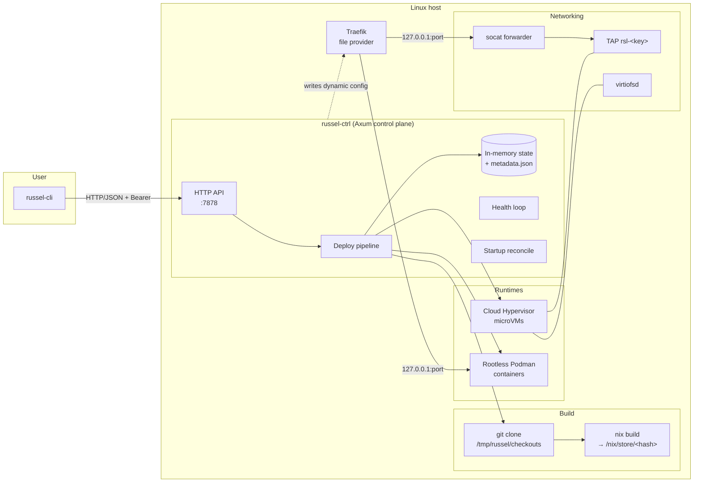
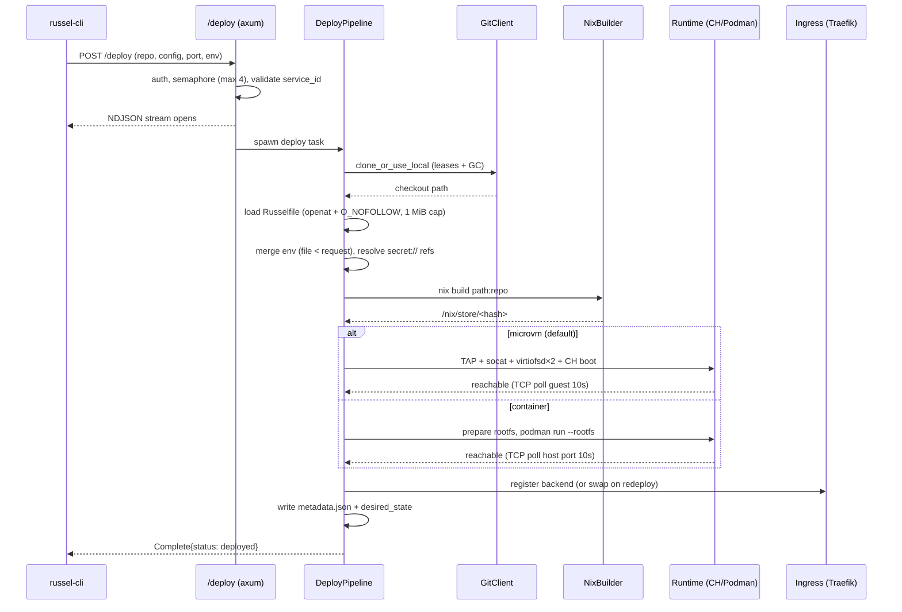
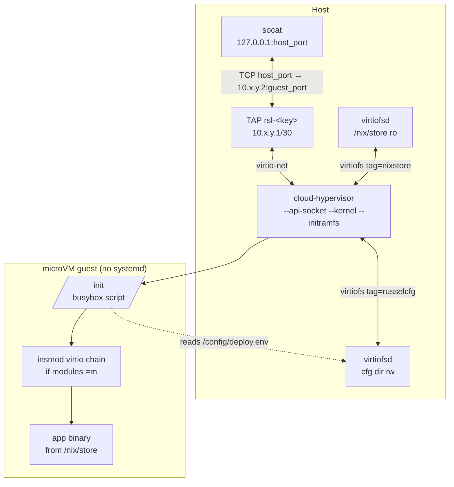
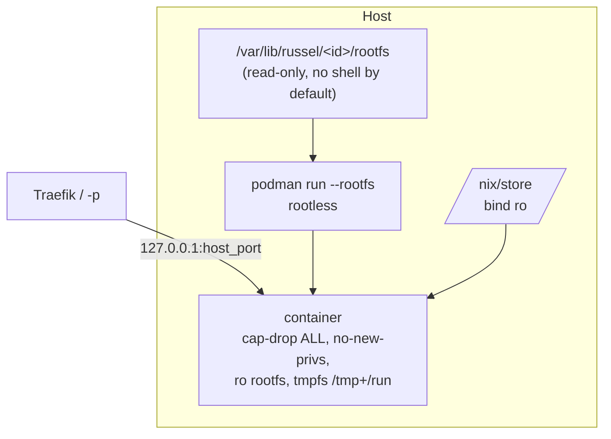
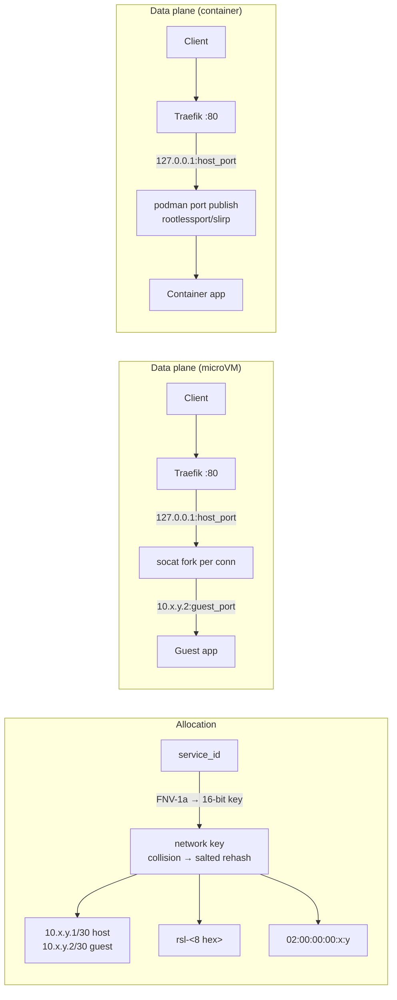
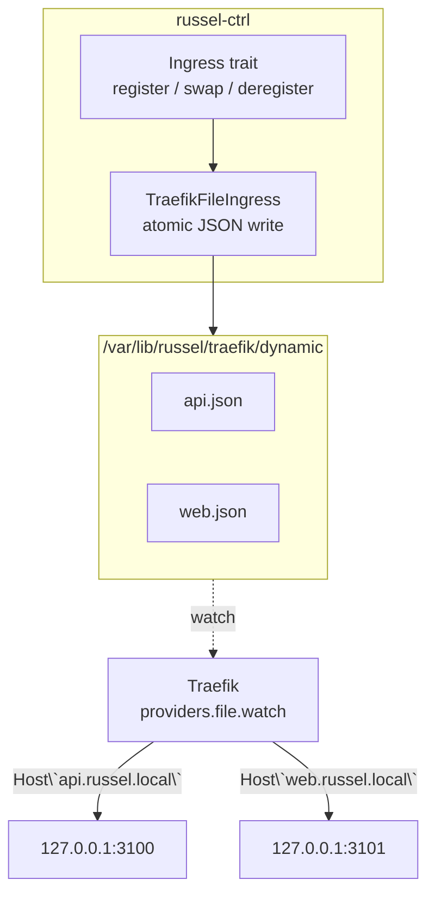
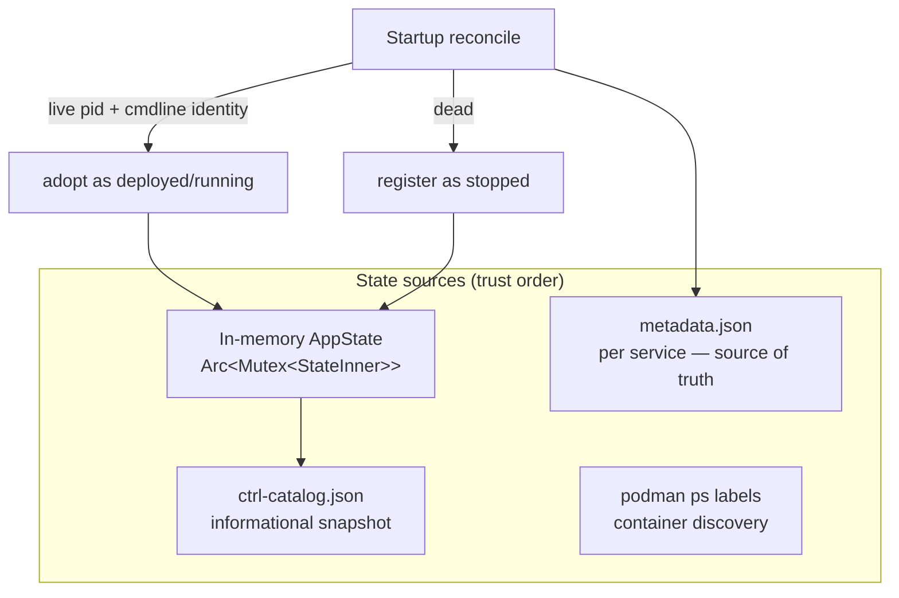
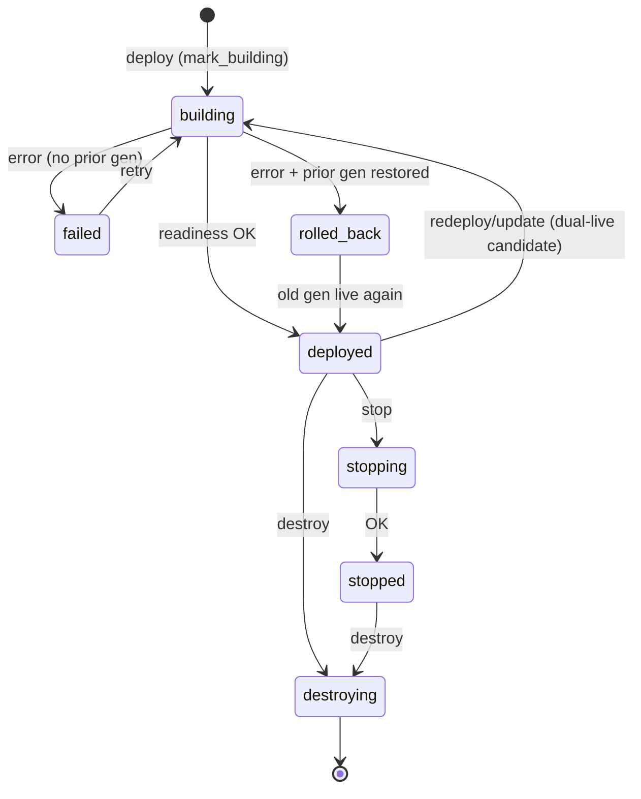

# Russel Architecture

Russel is a self-hosted deployment platform: it takes a source repository, builds it
with Nix, and runs the resulting store path as either a **Cloud Hypervisor microVM**
or a **rootless Podman container**, with Traefik as the HTTP ingress gateway.

This document is the canonical architecture reference. For API/CLI details see
[README.md](../README.md); for config schema see [russelfile.md](russelfile.md).

---

## 1. Overall Architecture

Key properties:

- **Single host, single control plane.** No clustering, no scheduler.
- **Nix is the only build system.** The deployable artifact is always a
  `/nix/store` path; both runtimes consume it directly (no image builds).
- **Two runtimes, one pipeline.** `service.type` in the Russelfile selects
  microVM (default) or container after the shared resolve/build phase.
- **Traefik is the primary ingress**; published host ports (`-p`) are an escape hatch.
- **Control-plane restarts are non-destructive**: workloads are detached children
  (or podman containers) that keep running; startup reconcile re-adopts them.

### Crate layout

| Crate | Role | Notable modules |
|-------|------|-----------------|
| `russel-core` | Shared types | `config.rs` (Russelfile schema + validation), `api.rs` (wire types) |
| `russel-cli` | CLI client | `commands.rs` (deploy/status/logs/vms/stop/destroy/update/secrets) |
| `russel-ctrl` | Control plane | `api.rs`, `deploy.rs`, `state.rs`, `microvm.rs`, `container.rs`, `network.rs`, `git.rs`, `build.rs`, `metadata.rs`, `reconcile.rs`, `health.rs`, `secrets.rs`, `traefik.rs`, `ingress.rs`, `warm_pool.rs`, `ch_api.rs` |

---

## 2. Deployment Pipeline

Pipeline stages emit NDJSON progress events (`resolve → build → create → start →
ready → complete`). Failure at any stage triggers candidate cleanup; on redeploy
with a prior generation it triggers **rollback** (§9).

Notable hardening on this path:

- `service_id` is restricted to `[A-Za-z0-9-_]` (max 128) before any filesystem use.
- The Russelfile is opened via an `openat(2)` descriptor chain with `O_NOFOLLOW`
  on every component — no validate-then-reopen TOCTOU window.
- Env values are validated (reserved keys, length, NUL/newline), then `secret://`
  refs are resolved from the host secret store, then re-validated.
- Concurrent deploys are bounded by a semaphore (default 4) and per-service by
  the `mark_building` guard.
- **Nix builds assume trusted source** unless you harden the host and set
  `RUSSEL_NIX_RESTRICTED=1` (sandbox options + no auto-flake). Threat model:
  [security/nix-builds.md](security/nix-builds.md).

---

## 3. MicroVM Runtime (Cloud Hypervisor)

Design decisions:

- **Direct CH orchestration**, no microvm.nix / systemd in the guest. Boot is
  kernel → busybox `/init` → app, which is how cold boot got under ~2 s.
- **Virtiofs, not initrd packaging**: the host `/nix/store` is mounted read-only
  in the guest, so the app closure never gets copied into an image.
- **Generic agent initramfs**: one cached CPIO for all services. Per-service
  config (`VM_IP`, `HOST_IP`, `PORT`, `APP`, user env) is delivered through a
  second virtiofs share (`russelcfg`) as a shell-quoted `deploy.env` that `/init`
  sources. Nothing app-specific is baked into the initramfs.
- **Kernel strategy**: prefer the repo's `microvm-kernel` flake attr (virtio/fuse
  built-in `=y`); fall back to stock nixpkgs kernel + module loading in init.
- **Readiness is a TCP poll** of the guest IP across the TAP (10 s), then a
  host-port check (2 s) to catch socat bind failures.
- **Lifecycle**: graceful stop via the CH REST API socket
  (`vm.shutdown` + `vmm.shutdown`), falling back to PID-ownership-verified
  signals, then pattern-anchored `pkill`. Destroy tears down TAP, socat,
  virtiofsd, ports, and the service directory.
- Each VM gets `--memory size=XM,shared=on` (shared is required for virtiofs),
  1 vCPU, a serial log at `/var/lib/russel/<id>/console.log`, and an API socket
  for lifecycle operations.

### Warm pool (experimental)

`RUSSEL_WARM_POOL=1` enables a snapshot/restore path: a golden paused VM is
prepared at ctrl startup and `restore_or_boot` clones it per deploy. Off by
default; known races (issue #101). See §12 — removal candidate.

---

## 4. Container Runtime (Rootless Podman)

Design decisions:

- **`--rootfs`, not images.** Russel prepares a minimal Docker-like tree
  (etc files, `/bin/<app>` symlink into the store closure) and bind-mounts the
  host `/nix/store` read-only. No registry, no image pulls, no Dockerfile.
- **Rootless only.** When ctrl runs as root (needed for microVM TAP/KVM),
  podman commands run as `RUSSEL_PODMAN_USER` or `SUDO_USER` via
  `sudo -u <user> -H env podman …`; rootless mode is verified via `podman info`.
- **Hardened defaults**: `--cap-drop ALL`, `--security-opt no-new-privileges`,
  `--read-only`, tmpfs `/tmp` and `/run`, `--memory` from the Russelfile.
  `debug = true` opts into bash/curl + `/usr/bin/env` for troubleshooting.
- **Passthrough args** (CLI `-- …`) are validated against an allowlist posture:
  Russel-owned flags (`--rootfs`, `--name`, `-d`, `-p`) and isolation-weakening
  flags (`--privileged`, `--cap-add`, `--device`, host namespaces, non-store
  bind mounts, `--env-file`, `--entrypoint`) are rejected.
- **Fail-closed redeploy**: the old container is stopped only after the new
  podman argv is fully validated.
- Logs via the `k8s-file` driver at `<service>/container.log`, falling back to
  `podman logs`.

Caveat: env vars (including resolved `secret://` values) are passed as
`podman -e` and are visible via `podman inspect`. Prefer the microVM runtime
for secret-heavy workloads (its `deploy.env` is `0600` in a `0700` dir).

---

## 5. Networking Model

- **Deterministic /30 per service** from a 16-bit FNV-1a key; collisions rehash
  with a salt and the result is persisted in metadata (`tap_id`, `host_ip`) so
  it survives restarts (`claim_subnet_key` on startup).
- **Port allocator**: in-memory registry, linear scan from 3100, availability
  probe by binding the publish address. Published binds default to `127.0.0.1`
  (`RUSSEL_PUBLISH_BIND` overrides).
- **socat arg0 tagging**: forwarders are spawned as `socat-russel-<id>` so
  lifecycle code can find and kill exactly one service's forwarder.
- Startup cleanup removes only **orphan** `rsl-*` TAPs with no live service
  directory — host iptables/Docker/VPN built-in chains are never flushed.
- No iptables NAT is used on the microVM path: publish is userspace (socat on
  the host OUTPUT path). Russel installs a dedicated **`RUSSEL-FORWARD`** chain
  jumped from built-in FORWARD for `-i rsl-+` / `-o rsl-+` with a terminal
  **DROP** (#187) **before** setting `ip_forward=1` for TAP L3, so there is no
  window where forwarding is enabled without the filter. That default-denies
  guest→guest and guest→off-host pivot via host routing without breaking socat
  publish. Rules are removed when the last `rsl-*` TAP goes away (same
  lifecycle as restoring `ip_forward`).
- Escape hatch (single-tenant debug only): `RUSSEL_FORWARD=allow` or
  `RUSSEL_DISABLE_FORWARD_FILTER=1` skips installing the filter and
  best-effort **removes** any previously installed Russel-owned FORWARD rules
  so a mid-flight toggle actually takes effect. **Residual risk:** with
  `ip_forward=1` and no filter, a compromised guest can route to other guests
  and non-local destinations via the host. Prefer the secure default.
- If `iptables` is missing or the process lacks `CAP_NET_ADMIN`, filter install
  fails soft with a warning (microVM boot continues) — production hosts should
  run privileged so isolation actually applies.

---

## 6. Traefik Ingress Architecture

- The `Ingress` trait (`ingress.rs`) decouples deploy/stop/destroy from Traefik;
  `TraefikFileIngress` is the default provider. Future providers (Caddy, NGINX)
  implement the same trait.
- Each service gets `Host(\`<service_id>.<domain>\`)` → `http://127.0.0.1:<host_port>`;
  domain defaults to `russel.local` (`RUSSEL_TRAEFIK_DOMAIN`, validated as a DNS name).
- **Zero-downtime redeploy** uses `Ingress::swap`: the candidate generation boots
  under `<id>_g<gen>` with a fresh backend port, the Traefik file is rewritten to
  point at the candidate, and only then is the old generation drained and the
  candidate promoted to the stable id.
- Writes are atomic (temp file + rename) so Traefik's watcher never reads a
  partial config. Deregistration on stop/destroy removes the file.
- Optional TLS: `RUSSEL_TRAEFIK_TLS=1` adds a `websecure` entrypoint +
  `tls.certResolver` to each router.

---

## 7. State, Metadata & Reconcile

- **`metadata.json` is the source of truth**: schema version, runtime, ports,
  PIDs, TAP identity, store/bin paths, generation id, `repo_url`/`config_path`,
  and `desired_state` (env refs, podman args, fixed port) so rollback, update,
  and health-restart can rebuild the exact original deployment.
- **Reconcile at startup** verifies PID identity via `/proc/<pid>/cmdline`
  (guards against PID reuse) before adopting a process as alive; containers are
  probed via `podman inspect` and by the `russel-<id>` naming convention.
- **Supervisor**: each deployed service has a generation-tagged supervisor task;
  child exit marks the service failed (bumped `process_generation` invalidates
  stale supervisors after redeploy).
- In-memory logs are capped (last 64 KiB); full history lives on disk
  (`console.log` / `container.log`).
- The catalog is written atomically (temp + fsync + rename, `0600`) after
  lifecycle transitions; it is informational and never consulted for decisions.

---

## 8. Security Architecture

| Layer | Mechanism |
|-------|-----------|
| API auth | Bearer token on every route when `RUSSEL_API_TOKEN` set (≥32 chars after trim, else refuse start); constant-time compare; non-loopback bind **refuses to start** without a token; `RUSSEL_REQUIRE_AUTH=1\|true\|yes` fails closed on loopback without a token; loopback-no-token is otherwise dev mode with warnings |
| Transport | HTTP only in ctrl — terminate TLS at a reverse proxy (see `docs/security-tls.md`) or use an SSH tunnel; CLI/dashboard **refuse** Bearer over `http://` to non-loopback hosts unless `--insecure` / `RUSSEL_INSECURE_CLEARTEXT=1` (loopback is warn-only) |
| Input validation | `service_id` charset/length; `bin_name` charset (no `.`/`..`); config path `openat`+`O_NOFOLLOW` chain; env key/value rules (reserved keys incl. `IFS`/`PATH`/`LD_*`, no newlines); secret name charset; podman passthrough allowlist posture |
| SSRF guard | Repo URLs restricted to `https/http/ssh/git@`; literal-IP hosts checked against link-local + cloud-metadata ranges for all schemes |
| Secrets | Host store `0600`/`0700`, atomic writes, names never values over the API, resolved at deploy time, never in argv; microVM delivery via `deploy.env` (`0600`) |
| Workload isolation | microVM: KVM boundary, ro store share, no guest shell; container: rootless, cap-drop ALL, no-new-privs, ro rootfs |
| Host integrity | Orphan-only TAP cleanup; no iptables mutation; CH API socket + service dirs `0700`; PID ownership verified via `/proc` before signals |
| Process hygiene | kill+wait with timeout on redeploy; supervisor generations; deploy semaphore; panic isolation per deploy task |

Residual risks documented in `AUDIT-2026-07-23.md`: DNS-rebinding around the
SSRF guard (no DNS resolution), metadata-IP redirects during clone, and
`podman inspect` env visibility on the container runtime.

---

## 9. Lifecycle: Redeploy, Rollback, Update, Health

- **Cold redeploy** (no live prior): backup dirs → kill+wait old children →
  teardown → boot new. **Dual-live redeploy** (live prior): candidate boots
  under a generation key, `Ingress::swap` cutover, old gen drained, promote.
- **Rollback** validates the `.bak` metadata *before* restoring directories,
  re-reserves ports with checked `u16::try_from`, restores the persisted
  `desired_state` env, re-boots, and only reports `rolled_back` after a
  readiness check. CLI exits non-zero so CI notices.
- **`update`** redeploys from the recorded `repo_url`/`config_path`
  (+ optional overrides), preserving the original env/podman args.
- **Health**: TCP probe per service every `RUSSEL_HEALTH_INTERVAL_SECS`
  (default 30, bind-aware); 3 consecutive failures → `failed`;
  `RUSSEL_HEALTH_RESTART=1` redeploys from `desired_state` through the same
  semaphore + shutdown guards as API deploys.
- **Shutdown**: SIGINT/SIGTERM → stop accepting, wait for in-flight deploys,
  detach children (workloads keep running). A flock on
  `/var/lib/russel/ctrl.lock` prevents two control planes from fighting.

---

## 10. Redundancy Review — Candidates for Removal

Things that exist but no longer pull their weight. Recommendation in **bold**.

| Feature | Status | Assessment |
|---------|--------|------------|
| `[database]` Russelfile section | **Vestigial** — parsed, then *rejected* when enabled (`config.rs`); provisioning was never implemented and is a SPEC non-goal | **Remove** `DatabaseConfig`/`PostgresConfig`/`RedisConfig` entirely. External DBs (user-managed) are the documented story; keeping a reject-only stub only buys schema churn |
| Warm pool (`warm_pool.rs`, snapshot/restore) | Experimental, `RUSSEL_WARM_POOL=1` opt-in, known races (#101), ~560 LoC | **Remove or quarantine.** Cold boot is already ~2 s via the agent initramfs; the pool's complexity buys little. If boot time matters again, rebuild it on CH's snapshot API from scratch |
| Legacy `/var/lib/microvms` marker dirs + gcroots cleanup | Migration shim for pre-ctrl-state installs | **Remove after one release** with a note; destroy already handles absence |
| Legacy dead initramfs stack (`build_initramfs`, `generate_init_script`, `boot()`) | `#[allow(dead_code)]` cold-boot fallback superseded by the agent initramfs | **Remove** (in progress in the audit-fix PRs) |
| Flat `/status` + `/logs` endpoints | CLI-compat shims that 400 when >1 service exists (#54) | **Remove** once CLI drops usage, or make them aggregate all services |
| `nix/modules/russel-host.nix`, `nix/microvm/README.md` | Host NixOS module docs | **Keep** if anyone installs the host via NixOS; otherwise move to docs/ |
| `bench.sh` (38 KB) + `docs/plans/` | Dev scaffolding | **Move** to `scripts/` + `docs/archive/`; not part of the product surface |
| `container debug = true` | Adds bash/curl/env wrapper to rootfs | **Keep** — genuinely useful, one config flag |
| `Memory` enum (single variant), unit structs (`GitClient`, `NixBuilder`, `PortAllocator`) | Over-abstraction (#50, #53) | **Simplify** opportunistically; low value churn |
| `SPEC.md` / `FINAL.md` / `AUDIT.md` at repo root | Historical artifacts | **Move** to `docs/archive/` |

The one-line answer on **database**: yes, remove it — it is schema without a
feature. If managed DBs ever return, they belong in a separate orchestrator
(or just `russel deploy` of a Postgres container), not in the core config.

---

## 11. Russelfile: TOML vs YAML

Current: `Russelfile.toml`, parsed with the `toml` crate into serde structs
(`deny_unknown_fields`), hand-rolled validators on top.

**Arguments for YAML**

- Multi-service files (`services:` list) read more naturally; anchors/aliases
  reduce repetition across similar services.
- Ecosystem familiarity for Kubernetes-adjacent users.

**Arguments for keeping TOML**

- The current schema is flat and small — YAML's advantages don't activate yet.
- YAML footguns are real config bugs: the Norway problem (`no:` → `false`),
  unquoted `on`/`off`/`y`/`n`, octal-ish numbers, tabs, duplicate keys accepted
  silently by some parsers, and a much larger grammar (bigger parser attack
  surface for a file consumed by a privileged daemon).
- TOML is unambiguous by design and already wired, tested, and documented.
- Migration cost: dual-format support (by extension) means two parsers, two
  error surfaces, and docs drift forever; hard cutover breaks every example.

**Recommendation: stay on TOML for v1.** If multi-service support lands and
repetition becomes painful, evaluate YAML (or TOML's own array-of-tables, which
already handles `[services.api]`-style repetition without a new parser). If a
move ever happens: support both by file extension for one release, validate
with the *same* serde structs via `serde_yaml`, and lint for YAML's implicit
typing traps (quote all scalars in docs, reject duplicate keys).

---

## 12. Learning Topics — What You Need to Build & Master This Project

### Linux (the deepest pillar)

- **KVM & virtualization**: `/dev/kvm`, VMM concepts, virtio device model
  (virtio-net, virtio-fs, virtio-pci legacy vs modern), Cloud Hypervisor's
  CLI + REST API socket, snapshot/restore semantics.
- **Kernel boot**: kernel cmdline, initramfs/initrd, busybox userland, kernel
  modules (`insmod`, `.ko.xz`, module dependency chains), `panic=` semantics.
- **Networking**: network namespaces, TAP/TUN, `/30` subnets, MAC addressing
  (locally administered `02:`), `ip link/addr/route`, `ip_forward`, iptables
  vs userspace forwarding tradeoffs, slirp4netns/rootlessport (how rootless
  podman publishes ports).
- **Containers**: mount/pid/user namespaces, cgroups v2 (memory limits),
  capabilities (`cap-drop`), seccomp, `no-new-privileges`, rootless Podman
  (subuid/subgid, `sudo -u` identity plumbing).
- **Filesystems & FDs**: `openat(2)`, `O_NOFOLLOW`/`O_DIRECTORY`/`O_CLOEXEC`,
  symlink/TOCTOU attacks, atomic rename, fsync durability, umask, hard links,
  FUSE (virtiofsd is a FUSE server), unix domain sockets and their permissions.
- **Processes**: fork/exec, signals and zombie reaping, PID reuse and why
  `/proc/<pid>/cmdline` identity checks are needed, `pkill -f` regex semantics,
  `flock` for single-instance guards, process arg0 spoofing.

### Rust

- **Async**: tokio (tasks, channels, `Notify` subtleties, semaphores,
  `JoinSet`, timeouts, `spawn_blocking`, process management), and when
  `std::sync::Mutex` is acceptable in async code (never across `.await`).
- **Error handling**: anyhow vs thiserror, context chains, fail-closed parsing
  (`try_from` over `as` casts — the #36 lesson).
- **Serde/TOML**: `deny_unknown_fields`, custom deserializers, defaults for
  wire-compat, `serde_json::Value` for schema-tolerant metadata.
- **Unsafe & FFI**: raw fd ownership (`OwnedFd`, `FromRawFd`), libc calls
  (`openat`, `flock`, `kill`), why each `unsafe` block needs a written proof.
- **API design**: axum routers/middleware/extractors, streaming bodies
  (NDJSON), graceful shutdown; reqwest client semantics (per-request timeout
  covers streaming!); clippy as an enforced style guide (unwrap bans).
- **Ownership patterns for systems code**: RAII guards (port reservations,
  deploy guards, checkout leases), `Arc<Mutex>` vs `OnceCell`, kill-on-drop
  child management.

### Nix

- Flakes (`packages.<system>.default`), the store and closures
  (`nix path-info -r`), purity (why auto-generated flakes must live in the
  checkout), `builtins.path` constraints, kernel package customization.

### Security engineering

- Threat modeling a privileged daemon: SSRF (URL parsing is *not* string
  splitting; userinfo/redirects/DNS rebinding), command/argument injection vs
  shell interpolation, secret lifecycle (at-rest perms, in-env visibility,
  `podman inspect` exposure), constant-time comparison, allowlist > denylist
  for security boundaries, TOCTOU classes of bug.

### Distributed/systems design

- Desired-state vs observed-state reconciliation (the Kubernetes lesson,
  applied to `metadata.json` + `AppState`), rollback design (validate before
  mutate, readiness before success), graceful degradation (dev mode, warm-pool
  fallback), backpressure (semaphores, bounded channels), idempotency of
  lifecycle operations.

### General programming practice

- Reading and auditing large diffs; writing findings with file:line evidence;
  designing fix slices that don't conflict; when to delete code (dead stacks,
  vestigial schema) instead of maintaining it; docs-as-contract (README drift
  is a bug); property-style unit tests for validators and allocators.

A pragmatic path: Linux namespaces + networking first (they explain *why* the
code looks like this), then tokio deeply (most subtle bugs in this codebase
were async-lifecycle bugs), then Nix (to extend the build side), then the
security topics (to review it with the right adversarial eye).
