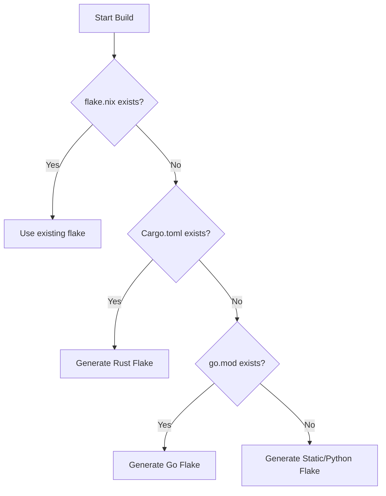

# Flake Auto-Generation Architecture

To provide a zero-config developer experience similar to Docker or Heroku buildpacks, Russel automatically generates a `flake.nix` build definition if the target repository doesn't check one in.

The implementation is managed inside the control plane builder: [`crates/ctrl/src/build.rs`](file:///home/crimxnhaze/russel-dev/crates/ctrl/src/build.rs) under the `ensure_flake_exists` function.

---

## Auto-Detection Rules

When a deployment starts, the builder scans the repository root for signature files to determine the application stack:



---

## Generated Templates

### 1. Rust Projects (`Cargo.toml`)
If a `Cargo.toml` is detected, Russel writes a flake utilizing `rustPlatform.buildRustPackage`. 

To avoid the necessity of manual `cargoHash` input, we use Nix's `cargoLock` feature which parses the project's checked-in `Cargo.lock` to fetch and verify crate dependencies atomically:

```nix
{
  description = "Auto-generated Rust flake by Russel";
  inputs.nixpkgs.url = "github:NixOS/nixpkgs/nixos-unstable";
  outputs = { self, nixpkgs }:
    let
      pkgs = nixpkgs.legacyPackages.x86_64-linux;
    in {
      packages.x86_64-linux.default = pkgs.rustPlatform.buildRustPackage {
        pname = "app";
        version = "0.1.0";
        src = ./.;
        cargoLock = {
          lockFile = ./Cargo.lock;
        };
      };
    };
}
```

### 2. Go Projects (`go.mod`)
If `go.mod` is found, Russel writes a flake using `pkgs.buildGoModule`:

```nix
{
  description = "Auto-generated Go flake by Russel";
  inputs.nixpkgs.url = "github:NixOS/nixpkgs/nixos-unstable";
  outputs = { self, nixpkgs }:
    let
      pkgs = nixpkgs.legacyPackages.x86_64-linux;
    in {
      packages.x86_64-linux.default = pkgs.buildGoModule {
        pname = "app";
        version = "0.1.0";
        src = ./.;
        vendorHash = null;
      };
    };
}
```

### 3. Fallback: Static / Python Web Server
For frontend projects, static sites, or generic scripts, Russel generates a shell script wrapper via `pkgs.writeShellScriptBin`. 

The source directory `./.` is copied into the Nix store during evaluation, and the script launches Python's built-in `http.server` serving the store path directory on the dynamic guest `PORT`:

```nix
{
  description = "Auto-generated Static site flake by Russel";
  inputs.nixpkgs.url = "github:NixOS/nixpkgs/nixos-unstable";
  outputs = { self, nixpkgs }:
    let
      pkgs = nixpkgs.legacyPackages.x86_64-linux;
    in {
      packages.x86_64-linux.default = pkgs.writeShellScriptBin "app" ''
        cd ${./.}
        exec ${pkgs.python3}/bin/python3 -m http.server "$PORT"
      '';
    };
}
```

---

## Customizing Builds

The generated `flake.nix` is written directly to the target repository build folder. 
If power users need to override this behavior (e.g., adding native dependencies, changing compiler flags, or using newer build pipelines), they can simply commit their own custom `flake.nix` to their repository. When Russel detects a committed `flake.nix`, the auto-generator steps aside completely.
