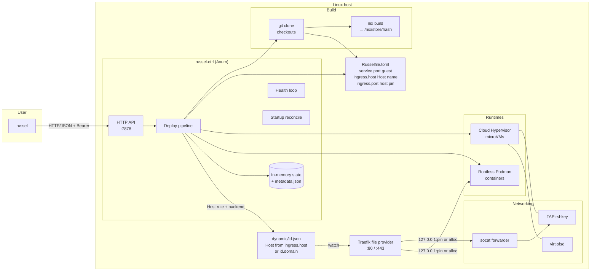
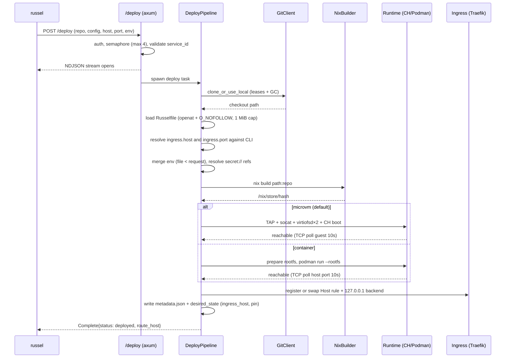
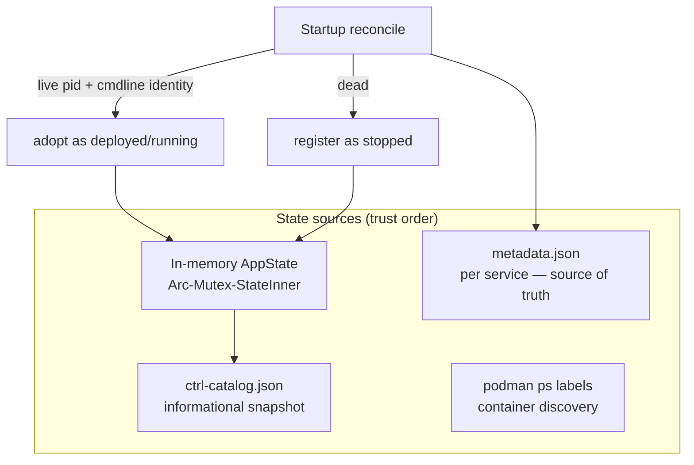

# Architecture

Russel is a single-host deployment platform: one Axum control plane takes a source repo, builds it with Nix, and runs the `/nix/store` closure as a microVM or rootless container, with Traefik as the HTTP ingress gateway.

This page is the canonical architecture reference. Schema lives in [Russelfile](../reference/russelfile.md), wire types in [API](../reference/api.md), flags in [CLI](../reference/cli.md).

## Overall

Key properties:

- **Single host, single control plane.** No clustering, no scheduler. Multi-node is not in this release.
- **Nix is the only build system.** The artifact is always a `/nix/store` path; both runtimes consume it directly.
- **Two runtimes, one pipeline.** `service.type` selects microVM (default) or container after shared resolve/build. See [Runtimes](runtimes.md).
- **Traefik is primary ingress.** `[ingress].host` is the exact `Host()` name; omit it for `<id>.<RUSSEL_TRAEFIK_DOMAIN>`. `-p` / `ingress.port` pin a host-side backend. See [Networking](networking.md).
- **Restarts are non-destructive.** Workloads are detached children/containers; startup reconcile re-adopts them. See [Lifecycle](lifecycle.md).

### Crate layout

| Crate | Role | Notable modules |
|---|---|---|
| `russel-core` | Shared types | `config.rs` (Russelfile schema + validation), `api.rs` (wire types), `tokens.rs` (constant-time compare) |
| `russel` (crate `russel-cli`) | CLI client | `commands.rs` (deploy/status/logs/ps/stop/destroy/update/secrets/login), `config.rs` (resolve), `init.rs` (scaffold), `ui.rs` |
| `russel-ctrl` | Control plane | `api/` (router/auth/secrets), `deploy/` (pipeline/runtime/rollback), `state/` (app/lifecycle/helpers), `microvm/` (runner/agent/spec), `container/` (runner/rootfs/passthrough/podman_user), `network/` (tap/subnet/ports), `git/`, `build.rs`, `metadata.rs`, `reconcile.rs`, `health.rs`, `secrets.rs`, `traefik.rs`, `ingress.rs` |
| `russel-agent` | Node-local agent (experimental) | `routes.rs`, `lifecycle.rs`, `auth.rs` (`RUSSEL_AGENT_TOKEN` → `RUSSEL_API_TOKEN` fallback), `capacity.rs` |

## Deploy pipeline

Stages emit NDJSON (`resolve → build → create → start → ready → complete`). Failure triggers candidate cleanup; redeploy with a prior generation triggers **rollback**. Concurrency is bounded by a semaphore (default 4, `RUSSEL_MAX_CONCURRENT_DEPLOYS`) plus a per-service `mark_building` guard.

Hardening on this path:

- `service_id` restricted to `[A-Za-z0-9-_]` (max 128) before any filesystem use.
- Russelfile opened via an `openat(2)` descriptor chain with `O_NOFOLLOW` on every component — no validate-then-reopen TOCTOU.
- Env validated (reserved keys, length, NUL/newline), `secret://` resolved from the host store, then re-validated.
- **Nix builds assume trusted source** unless `RUSSEL_NIX_RESTRICTED=1` (sandbox + no auto-flake). Threat model: [Nix builds](../security/nix-builds.md).

## State, metadata, reconcile

- **`metadata.json` is the source of truth**: schema version, `node_id` (`RUSSEL_NODE_ID` → hostname → `local`), runtime, ports, PIDs, TAP identity, store/bin paths, generation id, `repo_url`/`config_path`, and `desired_state` (env refs, podman args, `ingress_host`, host-side pin) so rollback/update/health-restart rebuild the exact Host and pin.
- **Reconcile** verifies PID identity via `/proc/<pid>/cmdline` (guards PID reuse) before adopting; containers via `podman inspect` + `russel-<id>` naming.
- **Supervisor** per service is generation-tagged; child exit marks `failed` (bumped `process_generation` invalidates stale supervisors).
- Logs capped in memory (last 64 KiB); full history on disk (`console.log` / `container.log`).
- Catalog written atomically (temp + fsync + rename, `0600`) after transitions; informational only, never consulted for decisions.
- A `flock` on `/var/lib/russel/ctrl.lock` prevents two control planes from fighting.

## Security boundaries

| Layer | Mechanism |
|---|---|
| API auth | Bearer on every route when `RUSSEL_API_TOKEN` set (≥32 chars, printable ASCII, constant-time compare); non-loopback bind refuses to start without a token; `RUSSEL_REQUIRE_AUTH=1` fails closed on loopback |
| Transport | HTTP-only ctrl; TLS at a proxy or SSH tunnel; CLI refuses Bearer over `http://` to non-loopback unless `--insecure` |
| Input | `service_id`/bin/config-path/env/secret/podman-allowlist validation; SSRF guard (`https/http/ssh/git@`, link-local + metadata-IP rejection) |
| Secrets | Host store `0600`/`0700`, atomic writes, names-only over API, resolved at deploy, never in argv |
| Isolation | microVM KVM boundary + ro store share; container rootless + cap-drop ALL + no-new-privs + ro rootfs |
| Host | Orphan-only TAP cleanup; no iptables mutation; CH socket + service dirs `0700`; PID ownership via `/proc` |

Residual risks (DNS-rebinding around the SSRF guard, metadata-IP redirects during clone, `podman inspect` env visibility) are tracked in the archived audits. See [Security overview](../security/overview.md).

## What's intentionally not here

- `[database.*]` is parsed then rejected when enabled — a vestigial stub, not a feature. Run databases as separate (user-managed) services.
- Warm pool (`RUSSEL_WARM_POOL=1`) is experimental, off by default, with known races. Cold boot is already ~2 s via the agent initramfs.
- Flat `/status` + `/logs` are single-service shims (`400` when >1 service exists). Prefer `/vm/{id}/…`.

## Related

- [Runtimes](runtimes.md) · [Networking](networking.md) · [Lifecycle](lifecycle.md) · [Builds](builds.md) · [API](../reference/api.md)
