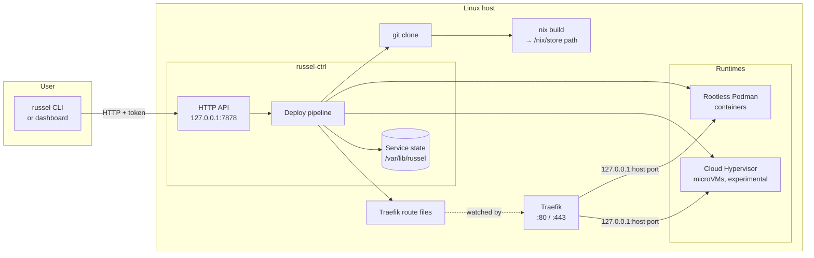
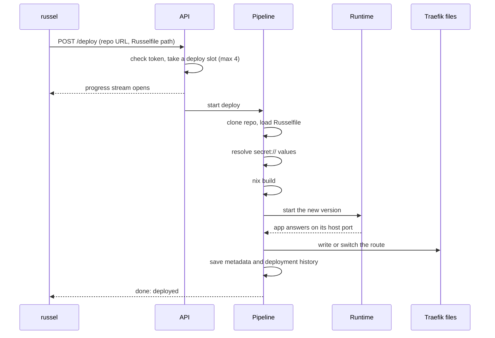

Russel runs on one Linux host. A single control plane, `russel-ctrl`, takes a git repo, builds it with Nix, and runs the result as a rootless container (or, experimentally, a microVM). Traefik, if you run it, routes host names to the apps.

## Overview

The design in short:

- **One host, one control plane.** There is no cluster and no scheduler.
- **Nix is the only build system.** Every build produces a `/nix/store` path, and both runtimes run it from there. Nothing is copied into an image.
- **Two runtimes, one pipeline.** `service.type` picks a rootless container (the default) or a microVM after the shared fetch and build steps. See [Runtimes](./runtimes.md).
- **Apps publish on loopback.** Each app gets a `127.0.0.1` host port. Traefik routes `Host()` names to those ports. See [Networking](./networking.md).
- **Restarting the control plane doesn't stop apps.** On start-up it finds the running apps again and takes them back over. See [Lifecycle](./lifecycle.md).

## A deploy, step by step

The CLI prints each stage as it arrives: `resolve`, `build`, `create`, `start`, `ready`. If a deploy fails and an earlier version exists, Russel restores it and reports `rolled_back`; the CLI still exits non-zero so scripts notice. At most 4 deploys run at once (`RUSSEL_MAX_CONCURRENT_DEPLOYS`), and only one per service.

Checks on this path:

- Service names are limited to `A-Z a-z 0-9 _ -`, 128 characters, before they touch the filesystem.
- The Russelfile must be a real file inside the repo (no symlinks) and under 1 MiB.
- Env vars are validated when the Russelfile loads and again after secrets are filled in.
- **Nix builds run code from the repo.** Only deploy repos you trust, or turn on `RUSSEL_NIX_RESTRICTED=1`. See [Nix build security](../security/nix-builds.md).

## State and restarts

Everything lives under `/var/lib/russel`, one folder per service:

| File | What it holds |
|---|---|
| `<id>/metadata.json` | The running version: runtime, ports, process ids, store paths, and the settings needed to rebuild it. This is the source of truth. |
| `<id>/deployments.json` | The last 20 deployments, for rollback. |
| `<id>/container.log`, `<id>/console.log` | Full app output. |
| `secrets/` | The secret store. |
| `traefik/dynamic/` | One route file per service. |

When the control plane starts, it reads each `metadata.json` and checks whether the app is still running. For a microVM it checks the process id and its command line, so a reused process id isn't mistaken for the app. For a container it asks Podman. Running apps are taken back over; the rest are marked stopped. A lock file stops a second control plane from starting on the same folder.

## Security boundaries

| Layer | How it's protected |
|---|---|
| API | Every request needs the token (at least 32 characters). The installer and the NixOS module always require it, and the control plane refuses to listen on a non-loopback address without one. |
| Transport | Plain HTTP on loopback only. Use an SSH tunnel or an HTTPS proxy. The CLI won't send the token over plain HTTP to another host. |
| Input | Names, paths, env vars, secrets, and Podman flags are validated. Repo URLs pointing at private, loopback, or cloud-metadata addresses are refused. |
| Secrets | Stored with mode `0600`, never returned by the API, never put on a command line. |
| Apps | Containers are rootless, drop all capabilities, and have a read-only root. MicroVMs add a separate kernel. |

More: [Security overview](../security/overview.md).

## Source layout

For contributors:

| Crate | Role |
|---|---|
| `russel-core` | Shared types: the Russelfile schema and its validation, API types |
| `russel-cli` | The `russel` command |
| `russel-ctrl` | The control plane: API, deploy pipeline, runtimes, networking, state |
| `russel-agent` | Experimental per-node agent for future multi-host use |

## Related

- [Runtimes](./runtimes.md) · [Networking](./networking.md) · [Lifecycle](./lifecycle.md) · [Builds](./builds.md) · [API](../reference/api.md)
