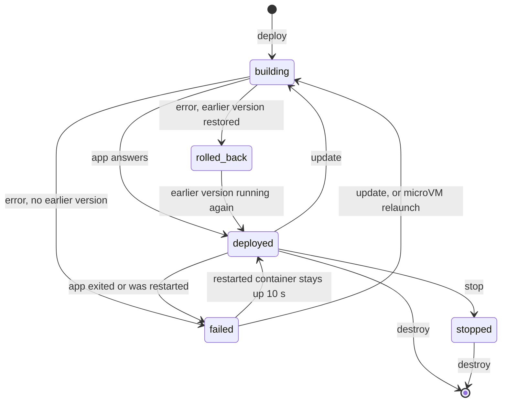

## Deploy and redeploy

An update normally runs the old and new versions side by side:

1. The new version starts on a fresh host port while the old one keeps serving.
2. Once the new version answers, Russel points the Traefik route at it and waits until Traefik actually serves it.
3. The old version gets no new requests from then on. It keeps running for 5 s so the requests it already has can finish (Russel watches the new version for crashes throughout this drain).
4. Russel asks the old version to stop and gives it 5 s more before killing it.

A service with `[[ports]]` or a pinned `[ingress].port` can't do that, because both versions would need the same fixed host ports. A service with a writable volume (`rw = true`) doesn't do it either: two versions would write to the same data. For those services Russel backs up the old version's files, stops it (waiting up to 5 s before killing it), and then starts the new one. There is a short gap in service.

For containers, the old container is only stopped after the new one's Podman command has been checked, so a bad flag never takes the running version down.

### What zero downtime covers

| Update | New requests during the update | Requests the old version is serving |
|---|---|---|
| **Side by side**: no `[[ports]]`, no pinned `[ingress].port`, no writable volume | None fail. The route moves once Traefik serves the new version, and the old one keeps answering until then. | No new ones arrive after the switch. They get 5 s to finish, then a stop request and 5 s more, then the old version is killed. |
| **Stop first**: `[[ports]]`, a pinned `[ingress].port`, or a writable volume | Fail from the moment the old version stops until the new one answers (and, without a pinned port, until Traefik picks up the new port). | A stop request and 5 s to finish, then the old version is killed. |

The stop request works the same way on both runtimes, as SIGTERM to the app:

- **Containers:** `podman stop` sends SIGTERM to the container's main process and kills it after 5 s. An app that runs as process 1 and has no SIGTERM handler ignores the signal, so it is killed when the 5 s are up.
- **MicroVMs:** Russel writes a stop request that the guest passes on to the app as SIGTERM. The VM powers off once the app exits, and is killed if it is still up after 5 s. A VM started by a Russel release before this one doesn't see the request and is killed after the 5 s.

Connections from clients end at Traefik, so keep-alive connections stay open through the switch. What can still be cut is anything the old version is still doing when it is killed: a request that takes longer than the drain and the grace period together, or a WebSocket or streaming response to the old version. Apps that finish their requests on SIGTERM get the full 10 s.

**How Russel knows Traefik switched.** Every route Russel writes adds an `X-Russel-Route` response header that names its backend. After the switch, Russel sends requests for the service's host name through Traefik's entry point (`RUSSEL_TRAEFIK_ENTRYPOINT`, default `http://127.0.0.1:80`) until one comes back with the new version's header, for up to 10 s. Traefik applies route changes at most every 2 s, so this usually takes a second or two.

- Traefik keeps serving the old version: the update fails and Russel points the route back at the old version, which kept running. The new one is removed after rollback confirmation. If confirmation fails, both generations stay running, the candidate remains managed under its generation key with its port reserved, and the failure reports that key. Confirm traffic has moved back before stopping or destroying that candidate.
- Nothing listens at the default entry point, or the proxy there never adds the header (it isn't Traefik reading Russel's routes): Russel can't confirm the switch. `update` prints a warning and goes on with the drain.
- `RUSSEL_TRAEFIK_ENTRYPOINT` set to an address makes the check strict: anything short of the new version answering fails the update. `off` skips the check.

## When a deploy counts as ready

"Ready" means the app itself accepted a connection. For containers Russel checks that the connection stays open, because Podman's port forwarder accepts connections even when nothing is listening behind it.

Some apps listen and then crash a moment later. Postgres without `/dev/shm`, for example, crashed about 200 ms after its port opened. What Russel does about that depends on whether a working version is at stake:

| Deploy | What Russel waits for | If the app crashes right after answering |
|---|---|---|
| **First deploy** (nothing running yet) | The first answer. | `deploy` has already reported `deployed`. The service reads `failed` within about a second, and is restarted unless it sets `restart = "no"` ([Restart on exit](#restart-on-exit)). |
| **Update or rollback, side by side** | The first answer. Traffic switches as soon as Traefik serves the new version, and the previous version keeps running for the **5 s drain**, with the new version watched throughout. | Traffic goes back to the previous version, which never stopped. The new one is removed, and `update` fails with a candidate crash error plus the app's last output. |
| **Update with `[[ports]]`, `[ingress].port`, or a writable volume** | The first answer, then **2 s** in which the new version must stay up. The previous version is already stopped. | The previous version is restored from its backup, and `update` fails with `rolled_back`. |
| **Relaunch** (restart on exit) | The first answer. | Russel waits a little longer before the next try ([Restart on exit](#restart-on-exit)). |

Why it works this way:

- **Crashes are caught during the deploy only when there's a working version to protect.** A first deploy has nothing older to keep, so waiting would only slow every deploy down. Russel reports the crash right afterwards instead.
- **Updates switch traffic straight away.** Users get the new version as soon as it answers and Traefik serves it. Only the `update` command waits the extra time, so its exit code is reliable: `russel update … && next-step` never continues past a version that died.
- **Russel watches for the process to exit.** A microVM powers itself off when the app exits, and a container shows as exited or restarted in Podman. An app that exits before it ever answers fails the deploy at once, without waiting out the 30 s timeout.
- **The watch catches start-up failures**: bad config, a missing file, a failed migration. Cold updates watch for 2 s; side-by-side updates watch through the 5 s drain and recheck before retiring the old generation. Crashes after retirement are handled by the supervisor.
- **Updates with pinned ports are the slow case.** The 2 s pass before Traefik routes to the new version, and a crash means a restore from backup. Leave `[[ports]]` and `[ingress].port` out unless the service needs them.

## Rollback

Each successful deploy is recorded in `/var/lib/russel/<id>/deployments.json`, newest first, up to 20 entries. Each entry keeps the repo, Russelfile path, and commit, plus the build output and the exact Russelfile it ran.

- **Automatic:** if an update fails and an earlier version worked, Russel restores the earlier version, starts it, waits for it to answer, and reports `rolled_back`. The CLI still exits non-zero so scripts notice the failure.
- **By hand:** `russel rollback <id>` starts the previous version's recorded build again, without fetching or building. `--version N` picks an older one, and `--rebuild` builds its commit from source instead.

Guide: [Update and rollback](../guides/update-rollback.md).

## Restart on exit

A service is restarted when it exits. This is `restart = "unless-stopped"`, the default; `restart = "no"` turns it off.

- **Containers:** Podman restarts the container at once. The service reads `failed` until the restarted container has been up for 10 s, then `deployed` again. A crash loop keeps it `failed`. `russel status` shows the restart count since the last deploy.
- **MicroVMs:** Russel starts the same build again, with the same config, env, volumes, and ports. Nothing is rebuilt. This happens when the app exits without a `stop` or `destroy`.
- **MicroVM crash loops** wait 1 s, 2 s, 4 s, and so on, up to 30 s, between attempts. A run of 60 s resets the wait. The previous run's output is kept as `console.log.1`.
- **`russel stop`** is remembered: the service stays down, even across control-plane restarts, until the next deploy.
- A deploy, stop, or destroy during a wait cancels the pending restart.

## After a reboot

When the control plane starts (after a server reboot, or after `systemctl restart russel-ctrl`), it starts every service it finds down again, unless the service sets `restart = "no"`:

- **Containers:** Russel starts the container the service last ran, with the same build, ports, volumes, and secrets. The service answers a second or two after the control plane is up.
- **MicroVMs:** Russel boots the recorded build again, the same way as [Restart on exit](#restart-on-exit).
- Nothing is rebuilt, and no deployment is added to the history.
- **`russel stop`** is remembered here too: a stopped service stays down until the next deploy.
- A service still running when the control plane starts (the control plane restarted, the server did not) is adopted as it is.

If a service can't start (for example, its container was removed outside Russel), it reads `failed`, and `russel logs` says why. `russel update <id>` deploys it again.

## Health

Two things mark a deployed service `failed`:

- **The app exits.** Russel checks each microVM's process every 500 ms. For containers it asks Podman every second for the first minute after a deploy or restart, then every 5 s.
- **The app stops answering.** Every `RUSSEL_HEALTH_INTERVAL_SECS` (default 30) Russel opens a TCP connection to each service. After 3 failures in a row the service is marked `failed`. With `RUSSEL_HEALTH_RESTART=1` it is also redeployed automatically.

The probe only checks that the port accepts a connection. A `/health` endpoint is still a good convention for your own checks.

## Control-plane restarts

- Stopping `russel-ctrl` waits for running deploys to finish and leaves every app running.
- On start, it reads each service's `metadata.json` and checks whether the app is still up (by process id and command line for microVMs, through Podman for containers). Running apps are taken back over; the rest are marked `stopped`.
- A lock on `/var/lib/russel/ctrl.lock` stops a second control plane from using the same folder.

## Related

- [Update and rollback](../guides/update-rollback.md) · [Architecture](./architecture.md) · [API](../reference/api.md) · [Troubleshooting](../guides/troubleshooting.md)
