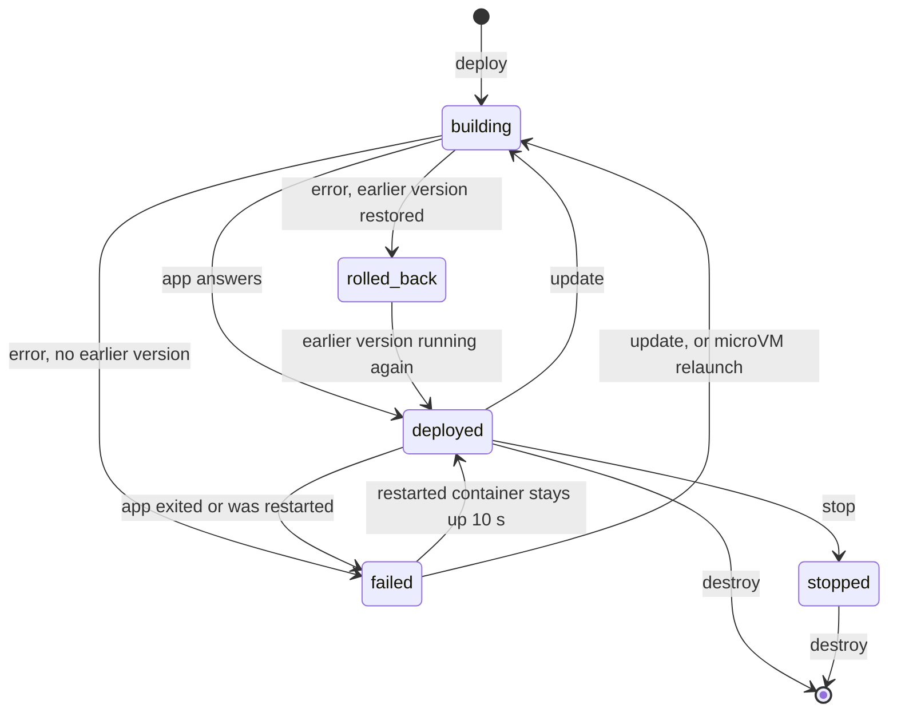

## Deploy and redeploy

An update normally runs the old and new versions side by side:

1. The new version starts on a fresh host port while the old one keeps serving.
2. Once the new version answers, Traefik's route switches to it.
3. The old version keeps running for 2 s in case the new one crashes, then stops.

A service with `[[ports]]` or a pinned `[ingress].port` can't do that, because both versions would need the same fixed host ports. A service with a writable volume (`rw = true`) doesn't do it either: two versions would write to the same data. For those services Russel backs up the old version's files, stops it (waiting up to 5 s before killing it), and then starts the new one. There is a short gap in service.

For containers, the old container is only stopped after the new one's Podman command has been checked, so a bad flag never takes the running version down.

## When a deploy counts as ready

"Ready" means the app itself accepted a connection. For containers Russel checks that the connection stays open, because Podman's port forwarder accepts connections even when nothing is listening behind it.

Some apps listen and then crash a moment later. Postgres without `/dev/shm`, for example, crashed about 200 ms after its port opened. What Russel does about that depends on whether a working version is at stake:

| Deploy | What Russel waits for | If the app crashes right after answering |
|---|---|---|
| **First deploy** (nothing running yet) | The first answer. | `deploy` has already reported `deployed`. The service reads `failed` within about a second. With `restart = "unless-stopped"` it is restarted ([Restart on exit](#restart-on-exit)). |
| **Update or rollback, side by side** | The first answer. Traffic switches at once, and the previous version keeps running for **2 s**. | Traffic goes back to the previous version, which never stopped. The new one is removed, and `update` fails with `new version crashed within 2s of answering` plus the app's last output. |
| **Update with `[[ports]]`, `[ingress].port`, or a writable volume** | The first answer, then **2 s** in which the new version must stay up. The previous version is already stopped. | The previous version is restored from its backup, and `update` fails with `rolled_back`. |
| **Relaunch** (`restart = "unless-stopped"`) | The first answer. | Russel waits a little longer before the next try ([Restart on exit](#restart-on-exit)). |

Why it works this way:

- **Crashes are caught during the deploy only when there's a working version to protect.** A first deploy has nothing older to keep, so waiting would only slow every deploy down. Russel reports the crash right afterwards instead.
- **Updates switch traffic straight away.** Users get the new version as soon as it answers. Only the `update` command waits the extra 2 s, so its exit code is reliable: `russel update … && next-step` never continues past a version that died.
- **Russel watches for the process to exit.** A microVM powers itself off when the app exits, and a container shows as exited or restarted in Podman. An app that exits before it ever answers fails the deploy at once, without waiting out the 30 s timeout.
- **2 s catches start-up failures**: bad config, a missing file, a failed migration. An app that crashes later still deploys, and is then caught like a first deploy.
- **Updates with pinned ports are the slow case.** The 2 s pass before Traefik routes to the new version, and a crash means a restore from backup. Leave `[[ports]]` and `[ingress].port` out unless the service needs them.

## Rollback

Each successful deploy is recorded in `/var/lib/russel/<id>/deployments.json`, newest first, up to 20 entries. Each entry keeps the repo, Russelfile path, and commit, so any of them can be rebuilt.

- **Automatic:** if an update fails and an earlier version worked, Russel restores the earlier version, starts it, waits for it to answer, and reports `rolled_back`. The CLI still exits non-zero so scripts notice the failure.
- **By hand:** `russel rollback <id>` rebuilds the previous version. `--version N` picks an older one. The rebuild goes through the normal pipeline, so it takes as long as a deploy.

Guide: [Update and rollback](../guides/update-rollback.md).

## Restart on exit

`restart = "unless-stopped"` keeps a service running after it exits.

- **Containers:** Podman restarts the container at once. The service reads `failed` until the restarted container has been up for 10 s, then `deployed` again. A crash loop keeps it `failed`. `russel status` shows the restart count since the last deploy.
- **MicroVMs:** Russel starts the same build again, with the same config, env, volumes, and ports. Nothing is rebuilt. This happens when the app exits without a `stop` or `destroy`, and when the control plane starts and finds the VM down (after a reboot, for example).
- **MicroVM crash loops** wait 1 s, 2 s, 4 s, and so on, up to 30 s, between attempts. A run of 60 s resets the wait. The previous run's output is kept as `console.log.1`.
- **`russel stop`** is remembered: the service stays down, even across control-plane restarts, until the next deploy.
- A deploy, stop, or destroy during a wait cancels the pending restart.

## Health

Two things mark a deployed service `failed`:

- **The app exits.** Russel checks each microVM's process every 500 ms. For containers it asks Podman every second for the first minute after a deploy or restart, then every 5 s.
- **The app stops answering.** Every `RUSSEL_HEALTH_INTERVAL_SECS` (default 30) Russel opens a TCP connection to each service. After 3 failures in a row the service is marked `failed`. With `RUSSEL_HEALTH_RESTART=1` it is also redeployed automatically.

The probe only checks that the port accepts a connection. A `/health` endpoint is still a good convention for your own checks.

## Control-plane restarts

- Stopping `russel-ctrl` waits for running deploys to finish and leaves every app running.
- On start, it reads each service's `metadata.json` and checks whether the app is still up (by process id and command line for microVMs, through Podman for containers). Running apps are taken back over; the rest are marked `stopped`.
- A lock on `/var/lib/russel/ctrl.lock` stops a second control plane from using the same folder.

## Related

- [Update and rollback](../guides/update-rollback.md) · [Architecture](./architecture.md) · [API](../reference/api.md) · [Troubleshooting](../guides/troubleshooting.md)
