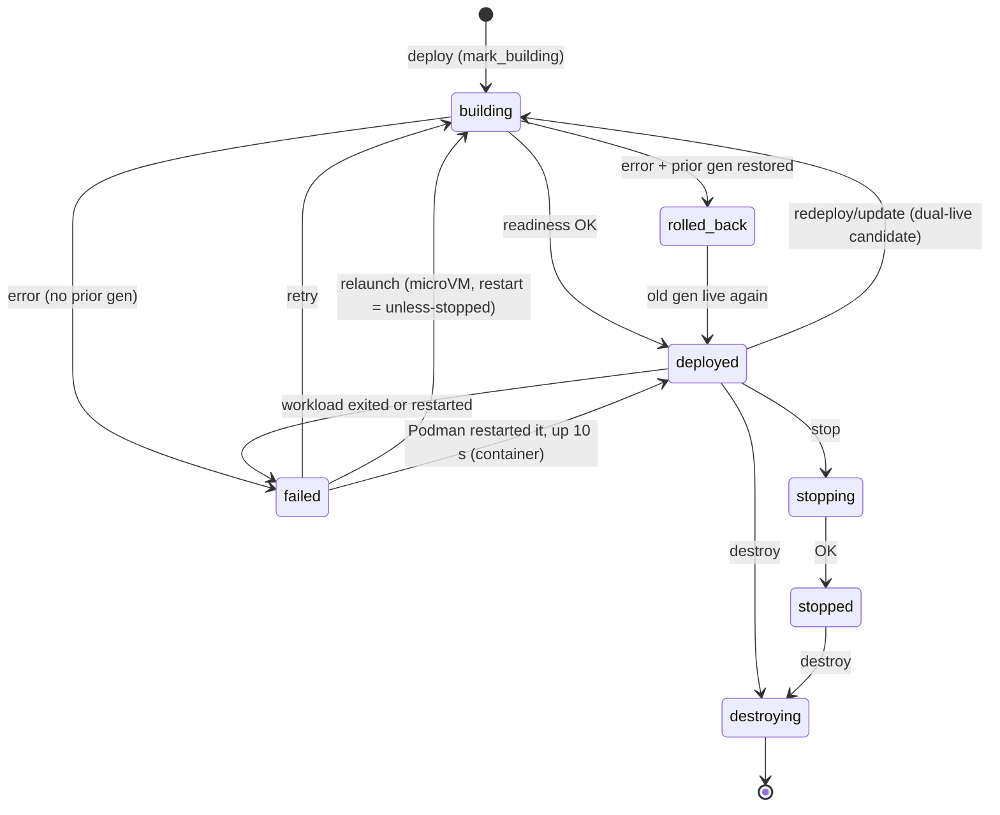

## Deploy and redeploy

- **Cold redeploy** (a prior generation that can't run beside the new one: the service has `[[ports]]`, whose fixed host ports two generations can't both bind): backup dirs → kill + wait old children (up to 5 s, then force-kill) → teardown → boot new.
- **Dual-live redeploy** (live prior, no `[[ports]]`): candidate boots under a generation key (`<id>_g<gen>`) with a fresh backend port, `Ingress::swap` cuts Traefik over, a 2 s hold watches the candidate (next section), old generation drains, candidate promotes.
- Container redeploys stop the old container only **after** the new podman argv validates (fail-closed).
- A redeploy (`russel update`) reuses ports after the old generation drains; the allocator prevents cross-service collisions.

## When a deploy counts as ready

"Ready" means the app accepted a connection (for containers, the app itself, not Podman's port forwarder: #462). Some apps listen and then crash a moment later; postgres without `/dev/shm` did so about 200 ms after its port opened. What Russel does about that depends on whether a working version is at stake (#493):

| Deploy | What Russel waits for | If the app crashes right after answering |
|---|---|---|
| **First deploy** (nothing running yet) | The first answer, nothing more. | `deploy` has already reported `deployed`. The service then reads `failed` within about a second: for a microVM the guest powers off and ctrl's supervisor sees the VM exit; for a container ctrl's exit watcher sees it exited or restarted in `podman inspect`. With `restart = "unless-stopped"` it is restarted ([Restart on exit](#restart-on-exit)). |
| **Update or rollback, dual-live** | The first answer. Traffic switches to the new version at once, and the previous version keeps running for **2 s**: `switch · New version is live; keeping the previous one running for 2s in case it crashes`. | Traffic goes back to the previous version, which never stopped. The new one is torn down, and `update` fails with `new version crashed within 2s of answering` plus the app's last output. |
| **Update, cold** (`[[ports]]`) | The first answer, then **2 s** in which the new version must stay up. The previous version is already stopped. | The previous version is restored from its backup, and `update` fails with `rolled_back`. |
| **Relaunch** (`restart = "unless-stopped"`) | The first answer. | The supervisor sees the exit and backs off before the next try ([Restart on exit](#restart-on-exit)). |

Why it works this way:

- **A crash is caught during the deploy only when there is something to protect.** A first deploy has no older version to keep, so waiting would only slow every deploy down. The supervisor reports the crash afterwards.
- **Updates switch traffic straight away.** The 2 s run while the new version already serves, with the old one still up as the fallback. Users of the app get the new version as soon as it answers; only `update` returns 2 s later, so that its exit code is honest (a script's `russel update … && …` never continues past a version that died).
- **A VM or container exit is the signal**, not another probe. A microVM's agent powers the guest off when the app exits, so `cloud-hypervisor` exiting means the app died. A container shows up as exited (or restarted) in `podman inspect`. An exit before the app answers at all fails at once, without waiting out the 30 s readiness timeout.
- **2 s is a trade-off, not a guarantee.** It catches apps that die while starting (bad config, a missing file, a failed migration). An app that crashes later still deploys, and is then caught like a first deploy.
- **Cold updates are the slow case.** The old version can't run beside the new one, so the 2 s pass before anything serves, and a crash means a restore from backup. Leave `[[ports]]` out unless the service needs it.

## Rollback

Each successful deploy appends a versioned row to `/var/lib/russel/<id>/deployments.json` (cap 20, newest first). Statuses: `active`, `previous`, `superseded`, `rolled_back`. Each row stores a `desired_state` snapshot (`repo_url`, `config_path`, `runtime`, `env`, `podman_args`, ports) so operators roll back without a fresh build plan.

- **Automatic:** if a redeploy fails after a prior success, Russel restores the old directory + metadata, re-spawns the previous VM/container, and confirms readiness before reporting `rolled_back`. The CLI still exits non-zero so CI detects the failure.
- **Explicit:** `POST /vm/{id}/rollback` with optional `{"version": N}` (omit to pick the latest `previous` with `rollback_ready`) redeploys from history through the normal pipeline. No recorded source → `409`.

Rollback validates the `.bak` metadata **before** restoring directories, re-reserves ports with checked `u16::try_from`, restores persisted `desired_state` env, re-boots, and only reports `rolled_back` after readiness. Instant dual-live retain-N=2 cutover (keeping the previous artifact hot) is a follow-up.

Operator guide: [Update and rollback](../guides/update-rollback.md). API: [API reference](../reference/api.md).

## Restart on exit

`restart = "unless-stopped"` keeps a service running without a redeploy.

- **Containers:** Podman's restart policy restarts the container, at once and without backoff. ctrl's exit watcher sees the restart (`RestartCount` in `podman inspect`) and the service reads `failed`; once the restarted container has stayed up for 10 s it reads `deployed` again, and `status` counts `restarts` since the last deploy. A crash loop keeps it `failed`.
- **MicroVMs:** ctrl relaunches the recorded generation (same build, config, env, volumes, and ports; nothing is rebuilt). This happens when the app or the VMM exits without a `stop` or `destroy`, and at ctrl start when reconcile finds the VM down (host reboot, or the VM died while ctrl was not running).
- **MicroVM crash loops** back off 1s, 2s, 4s, … up to 30s. The service reads `failed` between attempts, and `status` counts `restarts` since the last deploy. A run of 60s resets the backoff. A relaunch keeps the crashed run's console output as `console.log.1`.
- **`russel stop`** is recorded, so the service stays down across ctrl restarts until the next deploy.
- A deploy, stop, or destroy during a backoff wins: the pending relaunch is dropped.

## Update

`POST /vm/{id}/update` (CLI `russel update <id>`) redeploys from the recorded `repo_url`, `config_path`, and commit. Env, ports, and Podman flags come from the Russelfile at that commit. `--refresh` builds the source's latest commit instead; it is how you ship changes after the first `russel deploy`:

```bash
russel update <id> [--refresh] [--repo REPO] [--config PATH]
```

Same NDJSON stream as `deploy`, same semaphore + shutdown guards.

## Health

Two things mark a deployed service `failed`: its workload exiting, and the health probe below.

- **Exits.** ctrl owns each microVM's `cloud-hypervisor` process and polls it every 500 ms. A container's process belongs to Podman, so ctrl polls `podman inspect`: every second for the first minute after a deploy or restart, then every 5 s (one inspect costs about 40 ms of CPU). A container that exited, was restarted by Podman, or was removed reads `failed` at the next poll. A watcher belongs to one generation of the service, so `stop`, `destroy`, and a redeploy end it, and a late poll never marks the newer generation. Workloads that reconcile adopts at ctrl start are watched too (an adopted microVM by its PID, every 5 s); restarts a container had before ctrl started do not count.
- **Probes.** The app can hang with its process still up. The probe catches that.

The control plane TCP-probes each service every `RUSSEL_HEALTH_INTERVAL_SECS` (default 30, bind-aware). After 3 consecutive failures the service is marked `failed`. Set `RUSSEL_HEALTH_RESTART=1` to auto-redeploy from recorded `desired_state` through the same semaphore + shutdown guards as API deploys.

Expose a `/health` endpoint on `PORT` as a convention (Traefik is already the ingress; the probe itself is TCP-level).

## Shutdown and reconcile

- `SIGINT`/`SIGTERM` stops accepting, waits for in-flight deploys, and **detaches** children — workloads keep running.
- Next startup removes only **orphan** TAPs with no live service dir, claims persisted subnet keys, and reconciles: live PID (verified via `/proc/<pid>/cmdline` identity, guarding PID reuse) or live container (`podman inspect` + `russel-<id>` naming) is adopted as `deployed`/`running`; otherwise registered as `stopped`.
- Each service has a generation-tagged supervisor; child exit marks `failed` and bumps `process_generation` so stale supervisors cannot kill the replacement.
- A `flock` on `/var/lib/russel/ctrl.lock` prevents two control planes from fighting. Bench scripts use the same lock — never run two ctrls on one state dir.

## Related

- [Update and rollback](../guides/update-rollback.md) · [Architecture](./architecture.md) · [API](../reference/api.md) · [Troubleshooting](../guides/troubleshooting.md)
