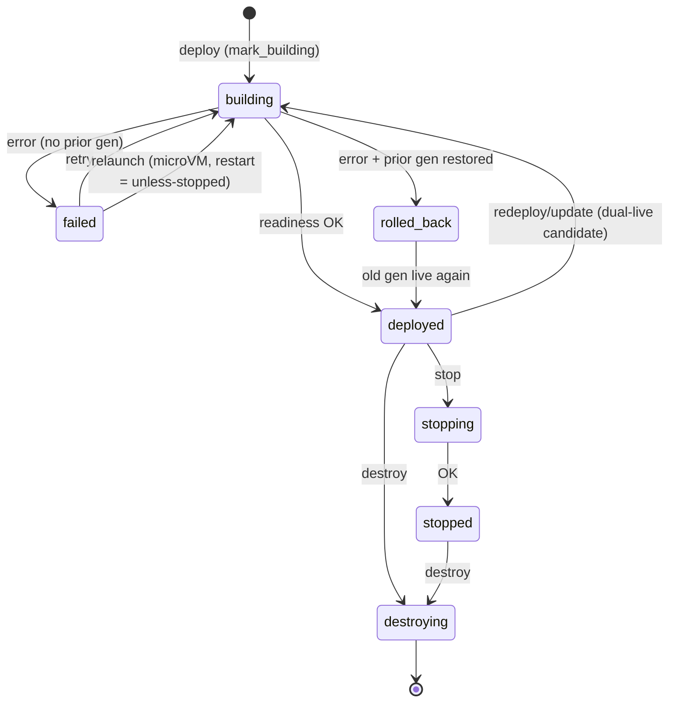

# Lifecycle



## Deploy and redeploy

- **Cold redeploy** (no live prior): backup dirs → kill + wait old children (up to 5 s, then force-kill) → teardown → boot new.
- **Dual-live redeploy** (live prior): candidate boots under a generation key (`<id>_g<gen>`) with a fresh backend port, `Ingress::swap` cuts Traefik over, old generation drains, candidate promotes.
- Container redeploys stop the old container only **after** the new podman argv validates (fail-closed).
- `russel apply` with an existing id reuses ports after the old generation drains; the allocator prevents cross-service collisions.

## Rollback

Each successful deploy appends a versioned row to `/var/lib/russel/<id>/deployments.json` (cap 20, newest first). Statuses: `active`, `previous`, `superseded`, `rolled_back`. Each row stores a `desired_state` snapshot (`repo_url`, `config_path`, `runtime`, `env`, `podman_args`, ports) so operators roll back without a fresh build plan.

- **Automatic:** if a redeploy fails after a prior success, Russel restores the old directory + metadata, re-spawns the previous VM/container, and confirms readiness before reporting `rolled_back`. The CLI still exits non-zero so CI detects the failure.
- **Explicit:** `POST /vm/{id}/rollback` with optional `{"version": N}` (omit to pick the latest `previous` with `rollback_ready`) redeploys from history through the normal pipeline. No recorded source → `409`.

Rollback validates the `.bak` metadata **before** restoring directories, re-reserves ports with checked `u16::try_from`, restores persisted `desired_state` env, re-boots, and only reports `rolled_back` after readiness. Instant dual-live retain-N=2 cutover (keeping the previous artifact hot) is a follow-up.

Operator guide: [Update and rollback](../guides/update-rollback.md). API: [API reference](../reference/api.md).

## Restart on exit

`restart = "unless-stopped"` keeps a service running without a redeploy.

- **Containers:** Podman's restart policy restarts the container.
- **MicroVMs:** ctrl relaunches the recorded generation (same build, config, env, volumes, and ports; nothing is rebuilt). This happens when the app or the VMM exits without a `stop` or `destroy`, and at ctrl start when reconcile finds the VM down (host reboot, or the VM died while ctrl was not running).
- **Crash loops** back off 1s, 2s, 4s, … up to 30s. The service reads `failed` between attempts, and `status` counts `restarts` since the last deploy. A run of 60s resets the backoff. A relaunch keeps the crashed run's console output as `console.log.1`.
- **`russel stop`** is recorded, so the service stays down across ctrl restarts until the next deploy.
- A deploy, stop, or destroy during a backoff wins: the pending relaunch is dropped.

## Update

`POST /vm/{id}/update` (CLI `russel update <id>`) redeploys from the recorded `repo_url` / `config_path`, preserving original env/podman args unless overridden:

```bash
russel update <id> [--repo REPO] [--config PATH]
```

Same NDJSON stream as `deploy`, same semaphore + shutdown guards.

## Health

The control plane TCP-probes each service every `RUSSEL_HEALTH_INTERVAL_SECS` (default 30, bind-aware). After 3 consecutive failures the service is marked `failed`. Set `RUSSEL_HEALTH_RESTART=1` to auto-redeploy from recorded `desired_state` through the same semaphore + shutdown guards as API deploys.

Expose a `/health` endpoint on `PORT` as a convention (Traefik is already the ingress; the probe itself is TCP-level).

## Shutdown and reconcile

- `SIGINT`/`SIGTERM` stops accepting, waits for in-flight deploys, and **detaches** children — workloads keep running.
- Next startup removes only **orphan** TAPs with no live service dir, claims persisted subnet keys, and reconciles: live PID (verified via `/proc/<pid>/cmdline` identity, guarding PID reuse) or live container (`podman inspect` + `russel-<id>` naming) is adopted as `deployed`/`running`; otherwise registered as `stopped`.
- Each service has a generation-tagged supervisor; child exit marks `failed` and bumps `process_generation` so stale supervisors cannot kill the replacement.
- A `flock` on `/var/lib/russel/ctrl.lock` prevents two control planes from fighting. Bench scripts use the same lock — never run two ctrls on one state dir.

## Related

- [Update and rollback](../guides/update-rollback.md) · [Architecture](architecture.md) · [API](../reference/api.md) · [Troubleshooting](../guides/troubleshooting.md)
