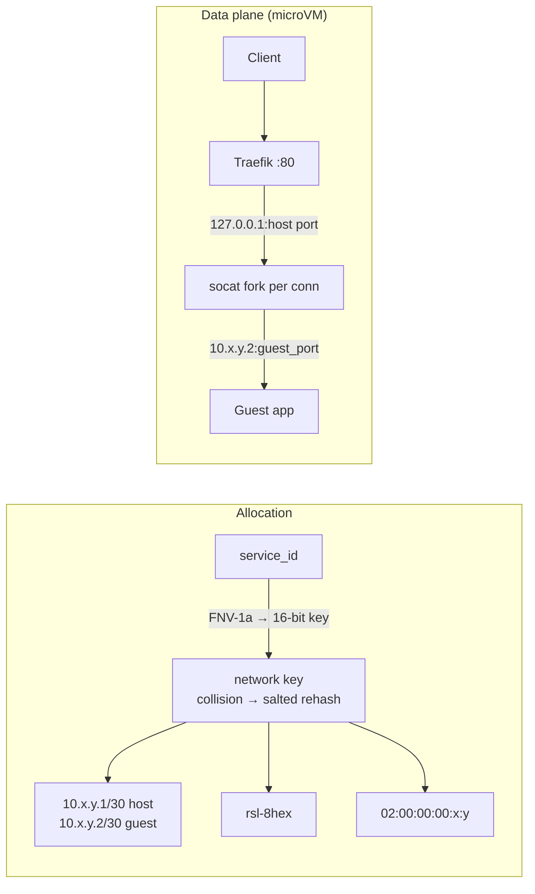
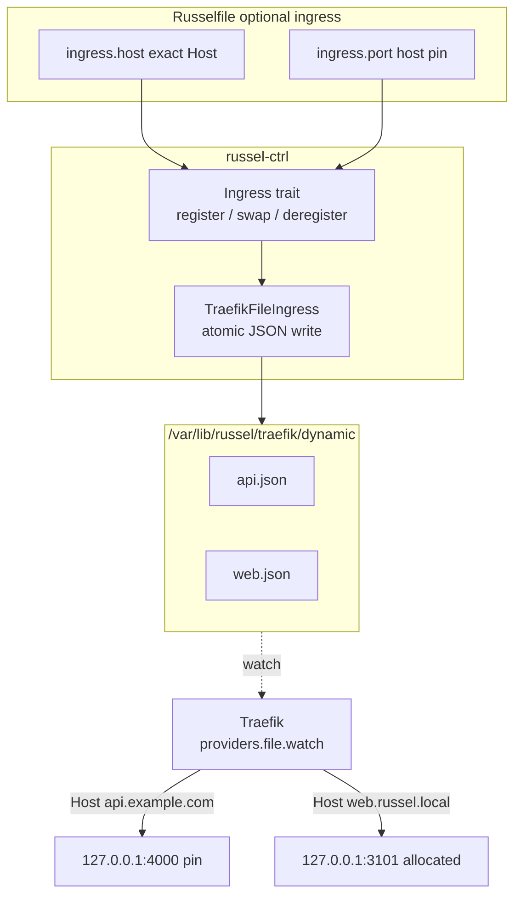

# Networking

Russel has two data planes (microVM userspace forwarding vs container port publish) and one primary HTTP ingress (Traefik). Published host ports (`-p`) are an escape hatch.

## MicroVM networking

- **Deterministic `/30` per service** from a 16-bit FNV-1a key; collisions rehash with a salt and persist in metadata (`tap_id`, `host_ip`) so they survive restarts (`claim_subnet_key` on startup). Collision space is ~16-bit (\<2% at 50 services) — add detection when scale demands it.
- **`socat` forwarders** are spawned as `socat-russel-<id>` (arg0 tagging) so lifecycle code finds and kills exactly one service's forwarder. Publish is userspace on the host OUTPUT path — no iptables NAT on this path.
- Startup removes only **orphan** `rsl-*` TAPs with no live service directory. Host iptables/Docker/VPN chains are never flushed.
- Guest L3 isolation uses a dedicated **`RUSSEL-FORWARD`** chain jumped from built-in `FORWARD` for `-i rsl-+` / `-o rsl-+` with a terminal **DROP**, installed **before** `ip_forward=1` so there is no window without the filter. Default-denies guest→guest and guest→off-host pivot via host routing without breaking `socat` publish. Rules are removed when the last `rsl-*` TAP goes away (same lifecycle as restoring `ip_forward`).
- Escape hatch (single-tenant debug only): `RUSSEL_FORWARD=allow` or `RUSSEL_DISABLE_FORWARD_FILTER=1` skips the filter and best-effort removes previously installed Russel-owned rules. With `ip_forward=1` and no filter a compromised guest can route via the host — prefer the secure default.
- If `iptables` is missing or the process lacks `CAP_NET_ADMIN`, filter install fails soft with a warning (boot continues).

### Unprivileged microVM networking (passt)

A ctrl without `CAP_NET_ADMIN` (every supported install) cannot create TAPs, so each VM gets a `passt --vhost-user` process instead (`RUSSEL_MICROVM_NET=passt`; `tap` forces the root path). passt is the NIC backend and publishes `bind:host_port` → `guest_port` itself, the way pasta does for rootless Podman. There is no TAP, socat, or iptables.

- The guest keeps the same `/30` addressing (`passt --address VM_IP --gateway HOST_IP`), but the VM IP is not routable from the host, so readiness probes the published port.
- `--no-map-gw` stops the gateway address from reaching host loopback (and so ctrl's API). Guests get outbound NAT through passt, like rootless containers.
- The passt pid and `net = "passt"` go into metadata so stop and destroy tear down the right thing.
- virtiofsd runs with `--sandbox=namespace` when ctrl is not root (`chroot` needs root).

## Container networking

Rootless Podman publishes `-p HOST:GUEST` (from CLI `-p` / allocator). No TAP, no `socat`, no `RUSSEL-FORWARD`.

## Port publishing

`-p HOST:GUEST` publishes a host port via `socat` (microVM) or Podman mapping (container). Both paths go through the port allocator so host ports never collide:

- In-memory registry, linear scan from `3100`, availability probed by binding the publish address.
- Published binds default to `127.0.0.1` (safer). Set `RUSSEL_PUBLISH_BIND=0.0.0.0` for wildcard, or a Tailscale IP for tailnet-only exposure.
- Health probes are bind-aware (`RUSSEL_PUBLISH_BIND`-aware TCP checks).

## Traefik gateway (primary HTTP ingress)

- The `Ingress` trait (`register` / `swap` / `deregister`) decouples deploy/stop/destroy from Traefik; `TraefikFileIngress` is the default provider.
- Each service may set `ingress.host` to the exact `Host()` name and `ingress.port` to a host-side backend pin. `service.port` remains the guest listen port. Without `ingress.host`, the route is `<service_id>.<RUSSEL_TRAEFIK_DOMAIN>`; without `ingress.port`, Russel allocates the backend.
- **Zero-downtime redeploy** uses `Ingress::swap`: the candidate boots under `<id>_g<gen>` with an ephemeral backend port, the Traefik file keeps the configured Host and switches to that candidate, then the old generation drains and the candidate promotes.
- A fixed host-side port is useful for `curl localhost:4000`, a firewall allowlist, or a non-HTTP publisher. It is not needed for ordinary HTTP traffic through Traefik, which routes on Host.
- The desired-state blob stores the operator's host-side pin (file or `-p`), never the dual-live candidate backend. The journal row records the live backend actually published for that generation; these can differ.
- After dual-live cutover, microVMs may reclaim a fixed host-side port with an extra forwarder. Containers keep the candidate publish port; this is an existing container reclaim limitation.
- Writes are atomic (temp + rename) so Traefik's watcher never reads a partial config. Stop/destroy removes the file; redeploy re-registers the new backend port.
- Optional TLS: `RUSSEL_TRAEFIK_TLS=1` adds `websecure` + `tls.certResolver` (`RUSSEL_TRAEFIK_CERT_RESOLVER`, blank falls back to `letsencrypt`).

With Traefik running, access `http://<ingress.host>` when set, otherwise
`http://<service_id>.russel.local`, after that DNS name points to the Traefik IP.
A custom `ingress.host` replaces the default `<service_id>` route; it does not add a second Host rule.
The backend host port is auto-allocated unless `ingress.port` or `-p` pins it.
No pin is needed for normal HTTP apps. Setup: [Traefik ingress](../guides/traefik-ingress.md).

## Related

- [Architecture](architecture.md) · [Runtimes](runtimes.md) · [Traefik ingress](../guides/traefik-ingress.md) · [Environment](../reference/environment.md)
