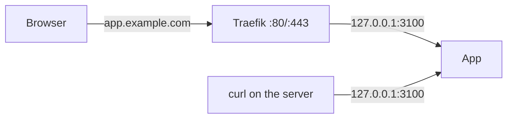

Every app is published on a port on the server's loopback address, `127.0.0.1`. Nothing is reachable from the internet until you put a proxy in front. Traefik is the supported way to do that: Russel writes its routes for you.

## Host ports

- Each app's `service.port` (the port it listens on inside its sandbox) is published on a host port.
- Unless you pin one, Russel picks the first free port from `3100` up. It can change on the next update, so check `russel ps`.
- To pin it, set `[ingress].port` in the Russelfile, for a script, firewall rule, or non-HTTP client that needs a fixed port. The pin holds across updates, rollbacks, and restarts. Apps reached through Traefik don't need a pin.
- `[[ports]]` publishes extra ports next to the main one, such as a second protocol.
- Ports bind to `127.0.0.1` by default. `RUSSEL_PUBLISH_BIND` changes that: `0.0.0.0` for every interface, or a Tailscale address to reach apps only over your tailnet.

**Containers** are published by rootless Podman, which uses `pasta` to forward the host port into the container.

**MicroVMs** are published by `passt`, which is also the VM's network card. The VM gets outbound internet through `passt`, but can't reach the host's loopback, so it can't reach the control plane's API.

## Traefik routes

Russel writes one small route file per service, `<service>.yaml`, into `/var/lib/russel/traefik/dynamic/`. Traefik's file provider watches that folder and applies changes within about 2 s. Russel never calls Traefik's API or reloads it; during an update it sends a request through Traefik to check which version answers.

| Russelfile | Route |
|---|---|
| `[ingress]` with `host = "api.example.com"` | ``Host(`api.example.com`)`` → the app |
| No `host` | ``Host(`<service name>.<RUSSEL_TRAEFIK_DOMAIN>`)``, for example `api.russel.local` |

A custom `host` replaces the default name. Two services can't claim the same name; the second deploy is rejected.

Stopping or destroying a service deletes its file, and Traefik stops routing to it. `RUSSEL_TRAEFIK_TLS=1` adds HTTPS and a certificate resolver to every route. Setup, including DNS and Let's Encrypt: [Traefik ingress](../guides/traefik-ingress.md).

## During an update

An update starts the new version on a fresh host port while the old one keeps serving. Once the new one answers, Russel rewrites the route file to point at it and waits until Traefik serves it. The old one then keeps running for 5 s to finish its requests (the first 2 s also catch a new version that crashes), gets a stop request, and is killed if it is still up 5 s later. The host name never changes. [What zero downtime covers](./lifecycle.md#what-zero-downtime-covers) has the details.

A service with a pinned `[ingress].port` or with `[[ports]]` updates differently, because two versions can't hold the same host port. Russel stops the old version, starts the new one on the same ports, and restores the old one if the new one fails or crashes within 2 s. The ports stay the same, at the cost of a short gap. See [Deploy and redeploy](./lifecycle.md#deploy-and-redeploy).

A pinned `[ingress].port` doesn't survive this switch: the app stays on the fresh port after the update, and every later update picks another one. Traefik always follows, so reach apps by name. (A microVM under a root control plane is the exception and gets its pin back.)

A service with `[[ports]]` can't run two versions at once, because both would need the same port. It stops the old version first and has a short gap. See [Lifecycle](./lifecycle.md#deploy-and-redeploy).

## MicroVMs as root

A control plane that runs as root (only for development and benchmarks) networks microVMs differently. Each VM gets a TAP device and its own `/30` subnet, and a `socat` process forwards the host port to the VM. An iptables chain, `RUSSEL-FORWARD`, blocks traffic between VMs and from VMs to other hosts. `RUSSEL_MICROVM_NET=tap` or `passt` forces one mode. On start-up Russel removes only TAP devices it created and left behind, and never flushes other iptables rules.

## Related

- [Architecture](./architecture.md) · [Runtimes](./runtimes.md) · [Traefik ingress](../guides/traefik-ingress.md) · [Environment](../reference/environment.md)
