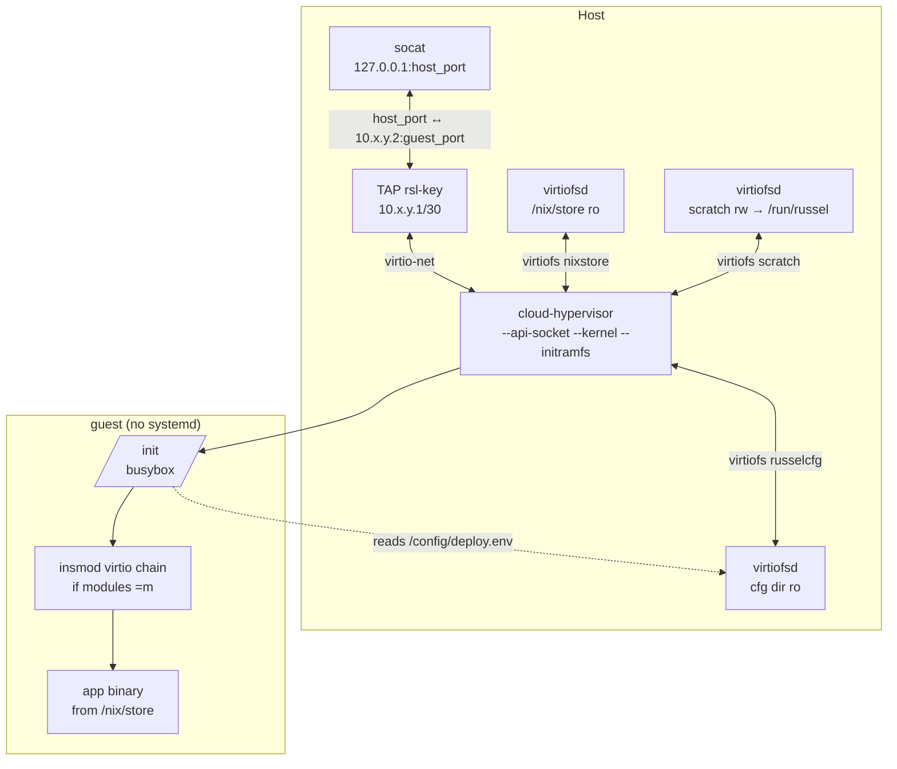
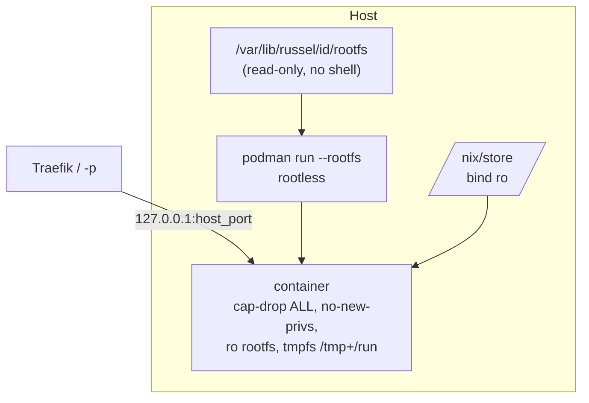

# Runtimes

`service.type` selects **isolation**. `service.guest` selects **userspace inside that isolation**. They are orthogonal — do not conflate them.

## At a glance

| `service.type` | Isolation | Host needs | Best for |
|---|---|---|---|
| `microvm` (default) | KVM / Cloud Hypervisor | `/dev/kvm`, TAP, `virtiofsd`, `socat`, `ip`, `iptables` | Stronger isolation, secret-heavy workloads |
| `container` | Rootless Podman `--rootfs` | Rootless Podman | Cheap no-KVM VPS, fastest spawn-to-ready |

| `service.guest` | What pid 1 / rootfs is | Status |
|---|---|---|
| `busybox` (default) | microVM: busybox `/init` execs one ELF. Container: hardened rootfs, no distro | Ships |
| `linux` | Host-built NixOS userspace (bash, coreutils, glibc, `$HOME`) | Parsed, then **rejected at load** until the boot path lands |

```toml
[service]
type = "container"  # or "microvm"
guest = "busybox"   # omit or busybox; linux errors until implemented
```

`--runtime` on the CLI must match `service.type` when both are set — it is a check, not an override.

## MicroVM (Cloud Hypervisor)



- **Direct CH orchestration**, no `microvm.nix`/systemd in the guest. Kernel → busybox `/init` → app; cold boot ~2 s.
- **Virtiofs, not image packaging**: host `/nix/store` mounted read-only; app closure never copied.
- **Generic agent initramfs**: one cached CPIO for all services. Per-service config (`VM_IP`, `HOST_IP`, `PORT`, `APP`, user env) arrives via a second virtiofs share (`russelcfg`) as shell-quoted `deploy.env` (mounted read-only). Guest writes `.agent_ready` to a separate `scratch/` share (`/run/russel` in-guest, no quota — bounded to that dir).
- **Kernel**: prefer the repo's `microvm-kernel` flake attr (virtio/fuse built-in `=y`); fallback is stock nixpkgs kernel + `insmod` of the virtio chain in `/init`.
- **Readiness**: TCP poll of the guest IP across TAP (10 s), then a host-port check (2 s) to catch `socat` bind failures.
- **Lifecycle**: graceful stop via CH REST socket (`vm.shutdown` + `vmm.shutdown`), fallback to PID-ownership-verified signals, then pattern-anchored `pkill`. Destroy tears down TAP, `socat`, `virtiofsd`, ports, service dir.
- Each VM gets `--memory size=XM,shared=on` (shared required for virtiofs), 1 vCPU (Russelfile `cpus` validated `1..=32`), serial log at `/var/lib/russel/<id>/console.log`, and an API socket.

Warm pool (`RUSSEL_WARM_POOL=1`, snapshot/restore of a golden paused VM) is experimental and off by default.

## Container (rootless Podman `--rootfs`)



- **`--rootfs`, not images.** Minimal Docker-like tree (etc files, `/bin/<app>` symlink into the closure) + host `/nix/store` bind-mounted read-only. No registry, no pulls, no Dockerfile.
- **Rootless only.** When ctrl runs as root (needed for microVM TAP/KVM), podman runs as `RUSSEL_PODMAN_USER` or `SUDO_USER` via `sudo -u <user> -H …`; rootless verified via `podman info`. Headless hosts may need `loginctl enable-linger $USER` for `/run/user/$(id -u)`.
- **Hardened defaults**: `--cap-drop ALL`, `--security-opt no-new-privileges`, `--read-only`, tmpfs `/tmp` + `/run`, `--memory` from the Russelfile. `debug = true` opts into bash/curl + `/usr/bin/env`.
- Entry points must be statically linked or use an absolute `/nix/store/…` interpreter (no shell, no `/usr/bin/env` by default). Do not pass a bare Nix package path as `--rootfs` yourself — use `russel deploy`.
- **Fail-closed redeploy**: old container stops only after the new podman argv validates. Readiness is a TCP poll of the published host port (10 s). Logs via `k8s-file` at `<service>/container.log`, fallback `podman logs`.
- Passthrough (`-- …`) uses an allowlist posture — see [First deploy](../getting-started/first-deploy.md).

> **Warning:** Container env (including resolved `secret://` values) is passed as `podman -e` and visible via `podman inspect`. Prefer microVMs for secret-heavy workloads.

## Choosing

- No `/dev/kvm` (most cheap VPS)? Use `type = "container"` everywhere.
- Need the strongest boundary or hide secrets from `podman inspect`? Use `type = "microvm"` on KVM-capable metal.
- Need a shell in the container for debugging? Set `debug = true` temporarily — do not ship it.

```bash
# MicroVM (default)
russel deploy examples/microvm-http -p 8080:3000 --vm-id api
# Container
russel deploy examples/basic-http -p 8080:3000 --vm-id api --runtime container
```

## Related

- [Architecture](architecture.md) · [Networking](networking.md) · [Russelfile](../reference/russelfile.md) · [Examples](../reference/examples.md)
