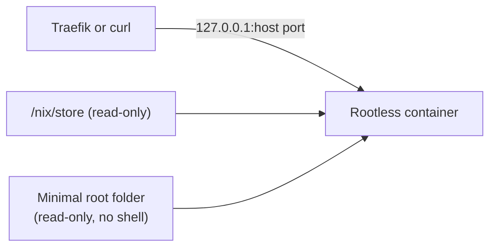
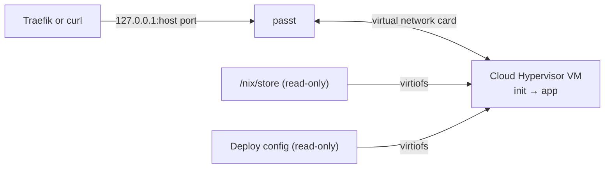

`service.type` in the Russelfile picks how an app is isolated:

| `service.type` | Isolation | The host needs | Use it for |
|---|---|---|---|
| `container` (default) | Rootless Podman | Podman with rootless support | Everything, including VPSes without KVM |
| `microvm` (experimental) | A small VM with its own kernel (Cloud Hypervisor) | `/dev/kvm`, `cloud-hypervisor` v52+, `virtiofsd`, `passt` | Trying out stronger isolation on KVM hardware |

Neither runtime needs root.

## What the app sees

Both runtimes give the app the same filesystem, so a Russelfile behaves the same on either:

| Path | Access |
|---|---|
| `/` | Read-only |
| `/nix/store` | Read-only. The app and its dependencies live here. |
| `/tmp`, `/run` | Writable, in memory, not executable, cleared on restart |
| `[[volumes]]` paths | Read-only, or writable with `rw = true`. The only data that survives a restart. |

An app that writes anywhere else gets `Read-only file system`.

The app runs as an unprivileged user that owns its volumes. It can still bind ports below 1024, and `HOME` is `/tmp` unless you set it. For an app that must run as root inside its sandbox, set `service.user = "root"`.

Russel sets `PORT` to `service.port`. Listen on `0.0.0.0`: an app bound to `127.0.0.1` can't be reached from outside its container.

## Containers



- **No image.** Russel builds a tiny root folder (a few `/etc` files and a link to your binary) and starts it with `podman run --rootfs`, with the host's `/nix/store` mounted read-only. There is no registry, no pull, and no Dockerfile.
- **Locked down by default.** All Linux capabilities are dropped, privilege escalation is blocked, the root is read-only, and memory is capped at `service.memory`. `debug = true` adds a shell and curl for troubleshooting; don't leave it on.
- **Entry point.** The binary must be statically linked or use an absolute `/nix/store` interpreter, because there is no shell or `/usr/bin/env`.
- **Ready means answering.** A deploy waits up to 30 s for the app to accept a connection on its published port and keep it open. A container that exits or restarts during that time fails the deploy at once, with its exit code and last 40 lines of output.
- **Watched after deploy.** Russel checks the container every second for the first minute, then every 5 s. If it exits, is removed, or is restarted by Podman, the service shows `failed`. See [Lifecycle: Health](./lifecycle.md#health).
- **Logs** are written to `/var/lib/russel/<id>/container.log`.

Plain env vars are visible to anyone who can run `podman inspect` as the `russel` account. `secret://` values are passed as Podman secrets and don't show up there, so put anything sensitive behind `secret://`.

## MicroVMs (experimental)

Each app gets its own Linux kernel. The VM boots in about 2 s into a tiny init that mounts the host's `/nix/store` and starts the app.



- **Needs:** read-write `/dev/kvm` (the installer adds `russel` to the `kvm` group), `cloud-hypervisor` v52 or newer (older versions hang with `cpus` > 1), `virtiofsd`, and `passt` on `PATH`. A deploy without them fails before the build and names what's missing.
- **Networking** uses `passt`, which gives the VM a network card and publishes its port on the host, the same job `pasta` does for rootless Podman.
- **Files** reach the VM over virtiofs: `/nix/store` read-only, the deploy config read-only, and each volume as its own share. The app is never copied.
- **Kernel.** Use Russel's kernel, which has the virtio drivers built in. The installer puts it at `/var/lib/russel/_pool/kernel/bzImage`.
- **When the app exits**, the init powers the VM off, and Russel sees the VM stop. A deploy fails at once with the app's exit code and the end of its console output, in `/var/lib/russel/<id>/console.log`.
- **Resources:** `service.memory` of RAM and `service.cpus` vCPUs (default 1).

The guest reserves `/config` and `/run/russel`, so volumes can't use those paths.

A control plane running as root uses a TAP device, `socat`, and an iptables chain in place of `passt`. That setup exists for development and benchmarks; see [Networking](./networking.md#microvms-as-root).

## Guest userspace

`service.guest` is separate from `service.type`: it picks what runs inside the sandbox.

| `service.guest` | What runs | Status |
|---|---|---|
| `busybox` (default) | Just your binary, started by a tiny init | Works |
| `linux` | A full NixOS userspace | Not implemented yet; rejected when the Russelfile loads |

## Choosing

- No `/dev/kvm`, which is most cheap VPSes: use containers.
- KVM hardware and you want to try a separate kernel per app: `type = "microvm"`, knowing it's experimental.

To compare the two, deploy the same Go app both ways:

```bash
russel deploy https://github.com/daschinmoy21/russel.git --config examples/basic-http/Russelfile.toml
russel deploy https://github.com/daschinmoy21/russel.git --config examples/microvm-http/Russelfile.toml
```

## Related

- [Architecture](./architecture.md) · [Networking](./networking.md) · [Russelfile](../reference/russelfile.md) · [Examples](../reference/examples.md)
