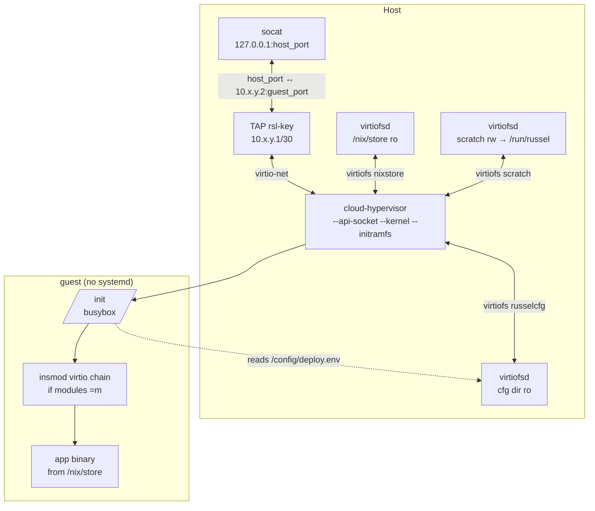
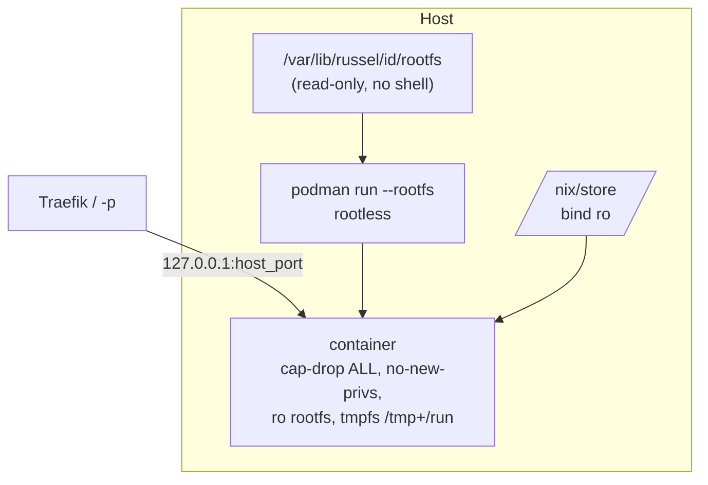

`service.type` selects **isolation**. `service.guest` selects **userspace inside that isolation**. They are orthogonal — do not conflate them.

## At a glance

| `service.type` | Isolation | Host needs | Best for |
|---|---|---|---|
| `container` (default) | Rootless Podman `--rootfs` | Rootless Podman | Cheap no-KVM VPS, fastest spawn-to-ready |
| `microvm` (experimental) | KVM / Cloud Hypervisor | `/dev/kvm` (kvm group), `virtiofsd`, `passt`; no root. A root ctrl uses TAP + `socat` + `iptables` instead of `passt` | Stronger isolation, secret-heavy workloads |

| `service.guest` | What pid 1 / rootfs is | Status |
|---|---|---|
| `busybox` (default) | microVM: busybox `/init` execs one ELF. Container: hardened rootfs, no distro | Ships |
| `linux` | Host-built NixOS userspace (bash, coreutils, glibc, `$HOME`) | Parsed, then **rejected at load** until the boot path lands |

```toml
[service]
type = "container"  # or "microvm"
guest = "busybox"   # omit or busybox; linux errors until implemented
```

Set the runtime with `service.type` in the Russelfile.

## Filesystem contract

Both runtimes give the app the same filesystem, so a Russelfile behaves the same on either:

| Path | Access |
|---|---|
| `/` | read-only |
| `/nix/store` | read-only (the app closure) |
| `/tmp` | tmpfs, writable, `noexec`, lost on restart |
| `/run` | tmpfs, writable, `noexec`, lost on restart |
| `[[volumes]]` guest paths | read-only, or writable with `rw = true`; the only data that persists |

An app that writes anywhere else gets `Read-only file system` on both runtimes. MicroVM guests also reserve `/config` (the deploy config) and `/run/russel` (a readiness marker), and `[[volumes]]` cannot use those paths.

The app runs as an unprivileged user by default, on both runtimes: the rootless Podman user in a container, the control plane's uid and gid in a microVM (which the guest names `app` in its `/etc/passwd`). That user owns the managed volumes, may bind ports below 1024, and gets `HOME=/tmp` unless the Russelfile sets `HOME`. Set `service.user = "root"` for an app that needs root inside its sandbox.

## MicroVM (Cloud Hypervisor)

> **Experimental in v0.1:** MicroVMs run from the same unprivileged `russel-ctrl` as containers. They need read-write `/dev/kvm` (put the ctrl user in the `kvm` group) and `passt` on PATH: `passt --vhost-user` is the VM NIC and publishes the port, the way pasta does for rootless Podman, and `virtiofsd` uses its unprivileged namespace sandbox. A ctrl that holds `CAP_NET_ADMIN` (root) uses a TAP, `socat`, and the `RUSSEL-FORWARD` iptables chain instead; `RUSSEL_MICROVM_NET=tap|passt` forces either. A deploy without the prerequisites fails before the build with the missing one.



- **Direct CH orchestration**, no `microvm.nix`/systemd in the guest. Kernel → busybox `/init` → app; cold boot ~2 s. `/init` runs the app as its child; when the app exits, `/init` writes `app exited with status N` to `console.log` and powers the VM off, which ctrl sees as the VM going down.
- **Virtiofs, not image packaging**: host `/nix/store` mounted read-only; app closure never copied.
- **Generic agent initramfs**: one cached CPIO for all services. Per-service config (`VM_IP`, `HOST_IP`, `PORT`, `APP`, user env) arrives via a second virtiofs share (`russelcfg`) as shell-quoted `deploy.env` (mounted read-only). Guest writes `.agent_ready` to a separate `scratch/` share (`/run/russel` in-guest, no quota — bounded to that dir).
- **Kernel**: prefer the repo's `microvm-kernel` flake attr (virtio/fuse built-in `=y`); fallback is stock nixpkgs kernel + `insmod` of the virtio chain in `/init`.
- **Readiness**: TCP poll of the guest IP across TAP (10 s), then a host-port check (2 s) through `socat` that the app answers (the connection must stay open 200 ms; `socat` closes it at once when the guest refuses). Under passt, the host port after the guest's `.net_ready` marker. Throughout, ctrl watches the `cloud-hypervisor` process: the agent powers the guest off when the app exits, so a VM exit fails the deploy at once with the app's exit code and the console tail. Updates also watch it for 2 s after the first answer: [When a deploy counts as ready](./lifecycle.md#when-a-deploy-counts-as-ready).
- **Lifecycle**: graceful stop via CH REST socket (`vm.shutdown` + `vmm.shutdown`), fallback to PID-ownership-verified signals, then pattern-anchored `pkill`. Destroy tears down TAP, `socat`, `virtiofsd`, ports, service dir.
- Each VM gets `--memory size=XM,shared=on` (shared required for virtiofs), 1 vCPU (Russelfile `cpus` validated `1..=32`), serial log at `/var/lib/russel/<id>/console.log`, and an API socket.

Warm pool (`RUSSEL_WARM_POOL=1`, snapshot/restore of a golden paused VM) is experimental and off by default.

## Container (rootless Podman `--rootfs`)



- **`--rootfs`, not images.** Minimal Docker-like tree (etc files, `/bin/<app>` symlink into the closure) + host `/nix/store` bind-mounted read-only. No registry, no pulls, no Dockerfile.
- **Rootless only.** When ctrl runs as root (for example to use microVM TAP networking), podman runs as `RUSSEL_PODMAN_USER` or `SUDO_USER` via `sudo -u <user> -H …`; rootless verified via `podman info`. Headless hosts may need `loginctl enable-linger $USER` for `/run/user/$(id -u)`.
- **Hardened defaults**: `--cap-drop ALL`, `--security-opt no-new-privileges`, `--read-only`, tmpfs `/tmp` + `/run`, `--memory` from the Russelfile. `debug = true` opts into bash/curl + `/usr/bin/env`.
- Entry points must be statically linked or use an absolute `/nix/store/…` interpreter (no shell, no `/usr/bin/env` by default). Do not pass a bare Nix package path as `--rootfs` yourself — use `russel apply`.
- **Fail-closed redeploy**: old container stops only after the new podman argv validates. Readiness (30 s): the app must accept a connection through the published host port that stays open for 200 ms or gets data. pasta, the rootless forwarder, accepts and then closes within ~20 ms when nothing listens behind it, so a bare connect proves nothing. Meanwhile `podman inspect` watches the container; an exit or restart fails the deploy at once with the exit code and the last 40 log lines. An app bound only to `127.0.0.1` times out with a hint to bind `0.0.0.0`. The health checker (`RUSSEL_HEALTH_RESTART`) uses the same probe. Logs via `k8s-file` at `<service>/container.log`, fallback `podman logs`.
- **Exit watcher**: after a deploy, ctrl polls `podman inspect` (1 s for the first minute, then 5 s). An exit, a Podman restart (`RestartCount` went up), or a removed container marks the service `failed`; a restarted container that stays up 10 s reads `deployed` again. See [Health](./lifecycle.md#health).
- Optional `service.podman_args` are validated fail-closed; see [Russelfile](../reference/russelfile.md).

> **Note:** plain container env is passed as `podman -e` and is visible via `podman inspect`. Resolved `secret://` values go through Podman secrets (`--secret ...,type=env`), so keep anything sensitive behind `secret://`.

## Choosing

- No `/dev/kvm` (most cheap VPS)? Use `type = "container"` everywhere.
- Need the strongest boundary? Use `type = "microvm"` on KVM-capable metal.
- Need a shell in the container for debugging? Set `debug = true` temporarily — do not ship it.

```bash
# MicroVM
russel apply examples/microvm-http
# Container
russel apply examples/basic-http
```

## Related

- [Architecture](./architecture.md) · [Networking](./networking.md) · [Russelfile](../reference/russelfile.md) · [Examples](../reference/examples.md)
